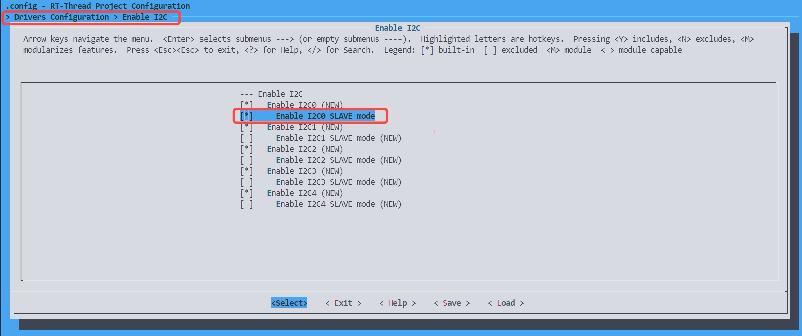

# 2.7 `I2C` Module API Manual

## 1. Overview

The K230 chip is equipped with 5 I2C hardware modules, supporting standard 100 kb/s, fast 400 kb/s, and high-speed 3.4 Mb/s communication modes. For IO configuration of channel output, please refer to the IOMUX module.

## 2. Master Device API Introduction

The `I2C` class is located in the `machine` module.

### 2.1 Example Code

```python
from machine import I2C

# Initialize I2C0 with a clock frequency of 100 kHz
i2c = I2C(0, freq=100000)

# Initialize a Soft I2C with a clock frequency of 100 kHz
# i2c = I2C(5, scl = 10, sda = 11, freq = 100000, timeout = 1000)

# Scan for slaves on the I2C bus
i2c.scan()

# Read data from the bus
i2c.readfrom(addr, len, True)

# Read data into a specified buffer
i2c.readfrom_into(addr, buf, True)

# Write data to a slave
i2c.writeto(addr, buf, True)

# Read from a slave register
i2c.readfrom_mem(addr, memaddr, nbytes, mem_size=8)

# Read register values into a buffer
i2c.readfrom_mem_into(addr, memaddr, buf, mem_size=8)

# Write data to a slave register
i2c.writeto_mem(addr, memaddr, buf, mem_size=8)

# Release I2C resources
i2c.deinit()
```

### 2.2 Constructor

```python
i2c = I2C(id, freq=100000, timeout = 1000, [scl, sda)
```

**Parameters**

- `id`: I2C device ID, Hardware I2C range [0~4] (i.e., I2C.I2C0~I2C.I2C4), Soft I2C range [5~9]
- `freq`: I2C clock frequency, Soft I2C maybe not so accurated.
- `timeout`: Soft I2C transfer timeout time in ms.
- `scl`: Soft I2C scl pin number.
- `sda`: Soft I2C sda pin number.

### 2.3 `scan` Method

```python
i2c.scan()
```

Scans for slave devices on the current I2C bus.

**Parameters**

None

**Return Value**

Returns a list containing all detected slave addresses.

### 2.4 `readfrom` Method

```python
i2c.readfrom(addr, len, True)
```

Reads data of a specified length from the bus.

**Parameters**

- `addr`: Slave address.
- `len`: Length of data to read.
- `stop`: Whether to send a stop signal, currently only supports the default value `True`.

**Return Value**

Returns the read data as `bytes`.

### 2.5 `readfrom_into` Method

```python
i2c.readfrom_into(addr, buf, True)
```

Reads data from a specified I2C address into a buffer.

**Parameters**

- `addr`: Slave address.
- `buf`: `bytearray` type, defines the length and stores the read data.
- `stop`: Whether to send a stop signal, currently only supports the default value `True`.

**Return Value**

None

### 2.6 `writeto` Method

```python
i2c.writeto(addr, buf, True)
```

Writes data to a slave.

**Parameters**

- `addr`: Slave address.
- `buf`: Data to be sent.
- `stop`: Whether to send a stop signal, currently only supports the default value `True`.

**Return Value**

Number of bytes successfully sent.

### 2.7 `readfrom_mem` Method

```python
i2c.readfrom_mem(addr, memaddr, nbytes, mem_size=8)
```

Reads values from memory, used for I2C memory-type devices.

**Parameters**

- `addr`: I2C slave address.
- `memaddr`: Memory address.
- `nbytes`: Number of bytes to read.
- `mem_size`: Memory address width, default is 8 bits.

**Return Value**

Returns the read data as `bytes`.

### 2.8 `readfrom_mem_into` Method

```python
i2c.readfrom_mem_into(addr, memaddr, buf, mem_size=8)
```

Reads data into a buffer, used for I2C memory-type devices.

**Parameters**

- `addr`: I2C slave address.
- `memaddr`: Memory address.
- `buf`: `bytearray` type, defines the length and stores the read data.
- `mem_size`: Memory address width, default is 8 bits.

**Return Value**

None

### 2.9 `writeto_mem` Method

```python
i2c.writeto_mem(addr, memaddr, buf, mem_size=8)
```

Writes data to a slave register, used for I2C memory-type devices.

**Parameters**

- `addr`: I2C slave address.
- `memaddr`: Memory address.
- `buf`: Data to be written.
- `mem_size`: Memory address width, default is 8 bits.

**Return Value**

None

## 3. Slave Device API Introduction

The `I2C_Slave` class is located in the `machine` module.

The K230 I2C controller defaults to master mode but can switch to slave mode through customized firmware. To enable slave mode, configure `Enable I2Cx SLAVE mode` using `make rtsmart-menuconfig` during firmware compilation (path: Drivers Configuration/Enable/I2C/Enable I2Cx/Enable I2Cx SLAVE mode), then recompile the firmware.



### 3.1 Example Code

In the following example, we use the K210 as the master device and the K230 as the slave device to demonstrate communication between the master and slave via the I2C bus. The K230's IO5 is used to notify the master to read data when there is a change.

**K230 Code**:

```python
from machine import Pin, FPIOA, I2C_Slave
import time
import os

# Initialize GPIO to notify the master of data updates
def gpio_int_init():
    # Instantiate FPIOA
    fpioa = FPIOA()
    # Set Pin5 to GPIO5
    fpioa.set_function(5, FPIOA.GPIO5)
    # Instantiate Pin5 as output
    pin = Pin(5, Pin.OUT, pull=Pin.PULL_NONE, drive=7)
    # Set output to high
    pin.value(1)
    return pin

pin = gpio_int_init()
# I2C slave device ID list
device_id = I2C_Slave.list()
print("Find I2C slave device:", device_id)

# Create an I2C slave device with address 0x10 and 20 bytes of simulated EEPROM memory
i2c_slave = I2C_Slave(device_id[0], addr=0x10, mem_size=20)

# Wait for the master to send data and read values from the mapped memory
last_dat = i2c_slave.readfrom_mem(0, 20)
dat = last_dat
while dat == last_dat:
    dat = i2c_slave.readfrom_mem(0, 20)
    time.sleep_ms(100)
    os.exitpoint()
print(dat)

# Modify values in the mapped memory
for i in range(len(dat)):
    dat[i] = i
i2c_slave.writeto_mem(0, dat)
# Notify the master of data updates
pin.value(0)
time.sleep_ms(1)
pin.value(1)
```

**K210 Code**:

```python
from machine import I2C
from fpioa_manager import fm
from maix import GPIO

fm.register(8, fm.fpioa.GPIO2)

int_io = GPIO(GPIO.GPIO2, GPIO.IN, GPIO.PULL_UP)

i2c = I2C(I2C.I2C3, freq=100000, scl=6, sda=7)

i2c.writeto_mem(0x10, 0, bytearray("abcdefghijklnmopqrst"))

while int_io.value() == 1:
    pass

buf = i2c.readfrom_mem(0x10, 0, 20)
print(buf)
```

### 3.2 `list` Method

Gets a list of all available I2C slave device IDs in the current system. This list is crucial for specifying the correct device ID when initializing an `I2C_Slave` object.

**Parameters**

- This method does not accept any parameters.

**Return Value**

Returns a list containing all available I2C slave device IDs in the system. These IDs are integers or similar identifiers used to specify the particular slave device when creating an `I2C_Slave` object.

**Notes**

- The ID values and their corresponding devices depend on the hardware platform and system configuration.
- If there are no available slave devices, the returned list may be empty.

### 3.3 Constructor

```python
i2c = I2C_Slave(id, addr=0x10, mem_size=20)
```

This constructor creates an I2C slave object, enabling the device to operate in slave mode and simulate an EEPROM with the specified memory size.

**Parameters**

- `id`: The unique ID of the I2C slave device. Obtainable by calling the `I2C_Slave.list()` method.
- `addr`: The I2C address in slave mode, used by the master device to recognize and communicate with it.
- `mem_size`: The size of the simulated EEPROM memory in bytes.

**Return Value**

Returns the created I2C slave object.

### 3.4 `readfrom_mem` Method

```python
i2c.readfrom_mem(addr, n)
```

Reads data from the mapped memory address (data written by the master device through EEPROM timing).

**Parameters**

- `addr`: Starting memory address from which to read data.
- `n`: Number of bytes to read.

**Return Value**

Returns a `bytearray` containing the n bytes of data read from the specified address.

### 3.5 `writeto_mem` Method

```python
i2c.writeto_mem(addr, data)
```

Writes data to the mapped memory address (data read by the master device through EEPROM timing).

**Parameters**

- `addr`: Starting memory address from which to write data.
- `data`: A `bytearray` containing the data to be written.

**Return Value**

None
