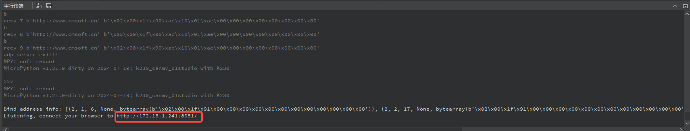
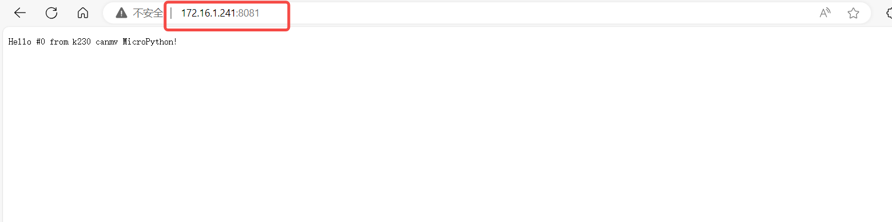

# HTTP Server Example Explanation

## Environment Preparation

First, ensure that your CanMV development board is connected to a router or switch via an Ethernet port, and that the router is functioning properly and has internet access. This setup is a prerequisite for making HTTP requests.

## Server Example Detailed Explanation

Below is a simple HTTP server Python example based on the CanMV development board. This server listens on port 8081 and can respond to HTTP requests from clients.

### Import Necessary Modules

```python
import socket  
import network  
import time
```

By importing the `socket`, `network`, and `time` modules, the `socket` module is used for network communication, `network` manages network interfaces (such as LAN), and `time` provides time-related functionalities.

### Define Response Content

```python
CONTENT = b"""\  
HTTP/1.0 200 OK  
Hello #%d from k230 canmv MicroPython!  
"""
```

Defines a byte string `CONTENT` as the HTTP response body. `%d` is a placeholder for a counter, indicating the sequence number of each request.

### Define Main Function

```python
def main(micropython_optimize=True):  
    # ... (subsequent code)
```

Defines the `main` function, with the parameter `micropython_optimize` controlling whether to enable specific MicroPython optimizations.

### Configure Network Interface

```python
def network_use_wlan(is_wlan=True):
    if is_wlan:
        sta = network.WLAN(0)
        sta.connect("Canaan", "Canaan314")
        print(sta.status())
        while sta.ifconfig()[0] == '0.0.0.0':
            os.exitpoint()
        print(sta.ifconfig())
        ip = sta.ifconfig()[0]
        return ip
    else:
        a = network.LAN()
        if not a.active():
            raise RuntimeError("LAN interface is not active.")
        a.ifconfig("dhcp")
        print(a.ifconfig())
        ip = a.ifconfig()[0]
        return ip
```

This code selects between WLAN or LAN interface based on the `is_wlan` parameter. In WLAN mode, it connects to a specified Wi-Fi network, while in LAN mode, it obtains an IP address via DHCP. After obtaining and printing the network configuration, it returns the IP address.

### Create and Configure Socket

```python
# Create socket object  
s = socket.socket()   
# Set socket options to allow address reuse  
s.setsockopt(socket.SOL_SOCKET, socket.SO_REUSEADDR, 1)   
# Bind to all network interfaces, listening on port 8081  
ai = socket.getaddrinfo("0.0.0.0", 8081)  
addr = ai[0][-1]  
s.bind(addr)   
# Start listening, with a maximum of 5 connection requests  
s.listen(5)  
print("Listening, connect your browser to http://%s:8081/" % (network.LAN().ifconfig()[0]))
```

This code creates a socket and enables the `SO_REUSEADDR` option to allow port reuse. It binds the address and starts listening on port 8081, supporting up to 5 connection requests.

### Handle Client Requests

```python
counter = 0  
while True:  
    # Accept connection  
    res = s.accept()  
    client_sock = res[0]  
    client_addr = res[1]  
    print("Client address:", client_addr)  
  
    # Choose different reading methods based on whether optimization is enabled  
    if not micropython_optimize:  
        # Use stream interface (suitable for CPython)  
        client_stream = client_sock.makefile("rwb")  
    else:  
        # Use MicroPython-specific interface  
        client_stream = client_sock  
  
    # Read request content  
    # ...  
  
    # Send response  
    client_stream.write(CONTENT % counter)  
    # Close connection  
    client_stream.close()  
  
    counter += 1  
    time.sleep(2)  
    if counter > 0:  
        print("HTTP server exit!")  
        s.close()  
        break
```

The server main loop accepts client connections, selects different reading methods to handle requests, sends a response with a counter, and closes the connection. After closing the connection, it waits for 2 seconds before entering the next loop.

### Complete Example

```python
import socket
import network
import time, os

CONTENT = b"""\
HTTP/1.0 200 OK

Hello #%d from k230 canmv MicroPython!
"""

def network_use_wlan(is_wlan=True):
    if is_wlan:
        sta = network.WLAN(0)
        sta.connect("Canaan", "Canaan314")
        print(sta.status())
        while sta.ifconfig()[0] == '0.0.0.0':
            os.exitpoint()
        print(sta.ifconfig())
        ip = sta.ifconfig()[0]
        return ip
    else:
        a = network.LAN()
        if not a.active():
            raise RuntimeError("LAN interface is not active.")
        a.ifconfig("dhcp")
        print(a.ifconfig())
        ip = a.ifconfig()[0]
        return ip

def main(micropython_optimize=True):
    ip = network_use_wlan(True)
    s = socket.socket()
    ai = socket.getaddrinfo("0.0.0.0", 8081)
    addr = ai[0][-1]
    s.setsockopt(socket.SOL_SOCKET, socket.SO_REUSEADDR, 1)
    s.bind(addr)
    s.listen(5)
    print("Listening, connect your browser to http://%s:8081/" % (ip))

    counter = 0
    while True:
        res = s.accept()
        client_sock = res[0]
        client_addr = res[1]
        print("Client address:", client_addr)
        client_sock.setblocking(True)
        client_stream = client_sock if micropython_optimize else client_sock.makefile("rwb")

        while True:
            h = client_stream.read()
            if h is None:
                continue
            print(h)
            if h.endswith(b'\r\n\r\n'):
                break
            os.exitpoint()

        client_stream.write(CONTENT % counter)
        client_stream.close()
        counter += 1
        time.sleep(2)
        if counter > 0:
            print("http server exit!")
            s.close()
            break

main()
```

For specific interface definitions, please refer to [socket](../../api/extmod/K230_CanMV_socket_API_Manual.md) and [network](../../api/extmod/K230_CanMV_network_API_Manual.md).

## Example Phenomenon and Operation Instructions

After running this example in the CanMV IDE K230, the IDE serial terminal will display the following information:



Copy the URL from the terminal and access it in your browser to view the server's response:


