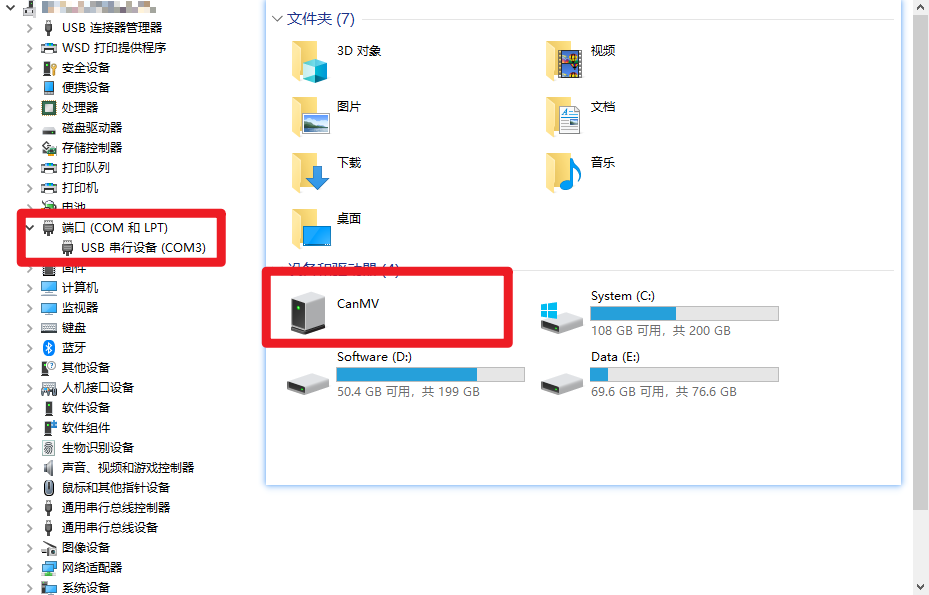
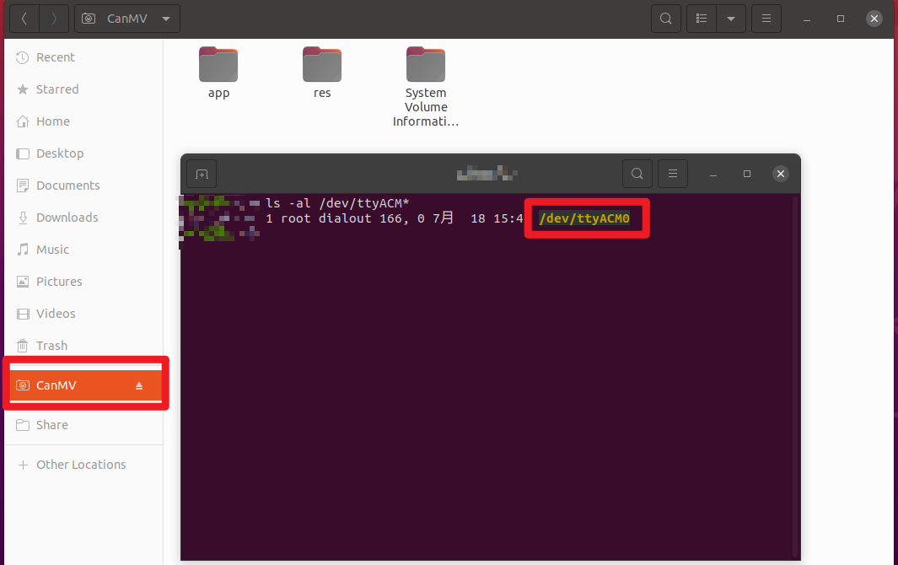

# 2. Flashing the Firmware

## 1. Overview

This chapter will introduce how to flash the CanMV firmware onto the development board.

## 2. Obtaining the Firmware

You can obtain the CanMV-K230 firmware from the following links: [Github](https://github.com/kendryte/k230_canmv/releases) or [Canaan Developer Community](https://www.kendryte.com/resource).

Please download the `.gz` archive file that starts with "CanMV-K230_micropython". After extracting it, you will get a `sysimage-sdcard.img` file, which is the firmware image for CanMV-K230.

```{admonition} Note
The downloaded firmware file is usually in gz compressed format. You need to extract it to get the img file that can be used for flashing.
```

## 3. Flashing the Firmware

### 3.1 Flashing on Windows Platform

On a Windows system, you can use the Rufus tool to flash the firmware to a TF card. The download address for Rufus is: [Rufus Official Website](http://rufus.ie/downloads/).

1. Insert the TF card into your computer and start the Rufus tool. Click the "Select" button in the interface and choose the firmware file to be flashed.
   
1. Click the "Start" button, and Rufus will automatically proceed with the flashing. The progress bar will display the flashing progress, and the system will prompt "Ready" upon completion.
   
   
   
   

### 3.2 Flashing on Linux Platform

Before inserting the TF card, first run the following command to check the current storage devices:

```bash
ls -l /dev/sd\*
```

Next, insert the TF card into the host machine and run the same command again to identify the newly added device node, which is the device node for the TF card.

Assuming the device node for the TF card is `/dev/sdc`, you can use the following command to flash the firmware to the TF card:

```bash
sudo dd if=sysimage-sdcard.img of=/dev/sdc bs=1M oflag=sync
```

## 4. Booting the Device

After successfully flashing the firmware, connect the development board to your computer. The system will automatically recognize a virtual U disk named `CanMV` and a virtual serial port.

```{note}
Some development boards may require two USB cables to be connected simultaneously. If you do not see the corresponding virtual U disk and virtual serial port, please check the connections.
```

### 4.1 Viewing Devices on Windows System

Open the Device Manager, and you will see the following devices:



- The USB Serial Device (COM3) is the REPL serial port for Micropython, which is the interface that CanMV-IDE needs to connect to. Please ensure that the firmware file you flashed starts with "CanMV-K230_micropython".

### 4.2 Viewing Devices on Linux System

On a Linux system, the serial port device will appear as:



- `/dev/ttyACM0` is the REPL serial port for Micropython, which is also the interface that CanMV-IDE needs to connect to. Please ensure that the firmware file you flashed starts with "CanMV-K230_micropython".
