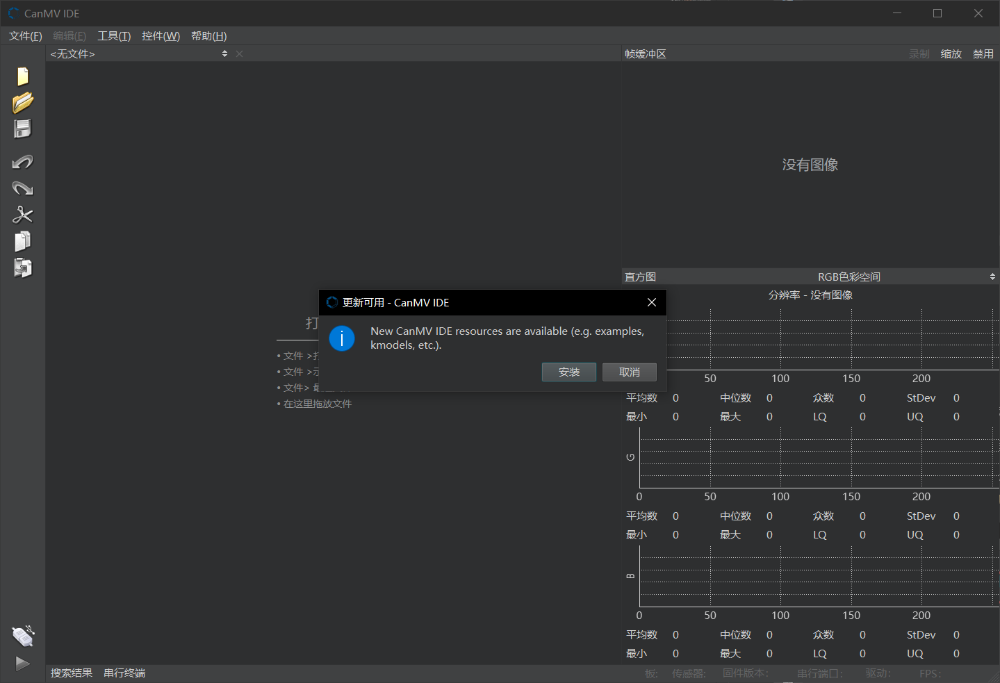

# 3. Connecting the IDE

## 1. Overview

CanMV IDE is developed based on the OpenMV project and is essentially the same as OpenMV IDE, with the main differences being modifications to the connection method and communication protocol components. CanMV IDE is developed using QtCreator.

CanMV IDE is suitable for the K230 and requires version 4.0.5 or higher. You can download it from [Github](https://github.com/kendryte/canmv_ide/releases) or the [Canaan Developer Community](https://developer.canaan-creative.com/resource).

Users can also opt to use the [OpenMV IDE](https://github.com/openmv/openmv-ide/releases), but please note that OpenMV IDE only supports connecting to the K230 and cannot connect to the K210. Using OpenMV IDE version 4.0 and above can achieve a higher image display frame rate.

## 2. Connecting the Development Board

Connect the development board to your computer via a USB interface, open CanMV IDE, and click the "Connect" button at the bottom left of the interface. Wait for the IDE to complete the connection with the development board.

If using OpenMV IDE, the operation is the same; simply click the "Connect" button at the bottom left.

## 3. Running Python Code

Before running the code, you first need to open a code file in the editor. Once the file is open, click the "Run" button at the bottom left to run the current file. For example, when running the `print('cool')` code, the output `cool` will be displayed in the serial terminal.

## 4. Saving Code and Files to the Development Board

To save code or files to the development board, you can click on the Tools option in the menu bar. This option provides two saving methods:

1. **Save As main.py**: Save the currently open script file as main.py, which will automatically run when CanMV starts.
1. **Save File to CanMV Cam**: Save the specified file to a specific path on the development board. Note that since only the SD card path is readable and writable on the development board, the file will be saved to `/sdcard/<specified path>`.

## 5. Displaying Images in the IDE

When the `display.init()` method is called to enable display output, CanMV IDE will display the same image as the LCD or HDMI. Additionally, you can use the `compress_for_ide()` method of the `image` class to send a specified image to the IDE for display. If the image is from the camera and the pixel format is YUV420SP, the system will automatically call the hardware encoder to encode the image, occupying the 4th channel of the VENC module. For detailed examples, refer to `Media/camera_480p.py`.

## 6. Updating Resources

When new resources (such as sample code or kmodel files) are available, CanMV IDE will prompt for an update with a dialog box at startup. Click the "Install" button to complete the update.

