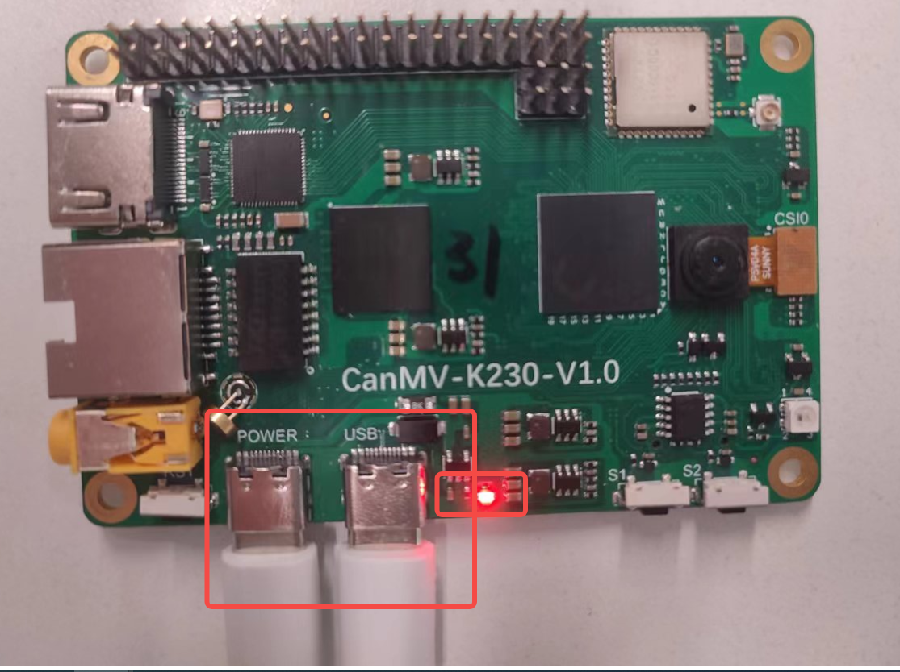
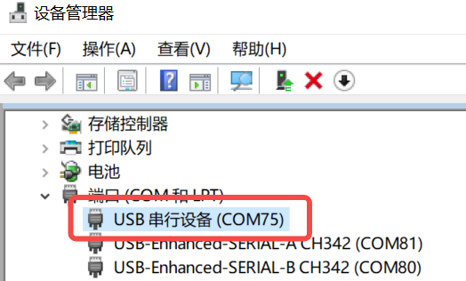

# CanMV-k230常见问题解答（MicroPython）

版权所有©2023北京嘉楠捷思信息技术有限公司

## 免责声明

您购买的产品、服务或特性等应受北京嘉楠捷思信息技术有限公司（“本公司”，下同）及其关联公司的商业合同和条款的约束，本文档中描述的全部或部分产品、服务或特性可能不在您的购买或使用范围之内。除非合同另有约定，本公司不对本文档的任何陈述、信息、内容的正确性、可靠性、完整性、适销性、符合特定目的和不侵权提供任何明示或默示的声明或保证。除非另有约定，本文档仅作为使用指导参考。

由于产品版本升级或其他原因，本文档内容将可能在未经任何通知的情况下，不定期进行更新或修改。

## 商标声明

、“嘉楠”和其他嘉楠商标均为北京嘉楠捷思信息技术有限公司及其关联公司的商标。本文档可能提及的其他所有商标或注册商标，由各自的所有人拥有。

**版权所有 © 2023北京嘉楠捷思信息技术有限公司。保留一切权利。**
非经本公司书面许可，任何单位和个人不得擅自摘抄、复制本文档内容的部分或全部，并不得以任何形式传播。

## 目录

[TOC]

## 1.硬件类问题解答

## 2.SDK类问题解答

### 2.1 IDE无法联接Canmv-K230开发板

1、请确定开发板两个USB口都与电脑连接。

2、查看电脑的设备管理器

是否有"USB串行设备(COMxx)的设备，如果没有请重新插拔USB。如果还没有，则请更换USB线。

## 3.nncase类问题解答

## 4.AI demo类问题解答
