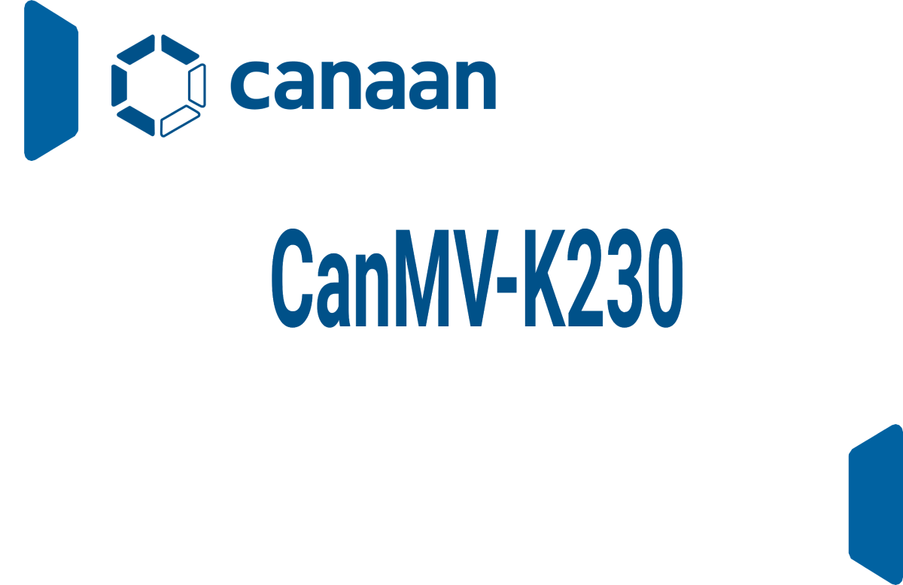

# CanMV-K230 版本说明

版权所有©2023北京嘉楠捷思信息技术有限公司

## 免责声明

您购买的产品、服务或特性等应受北京嘉楠捷思信息技术有限公司（“本公司”，下同）及其关联公司的商业合同和条款的约束，本文档中描述的全部或部分产品、服务或特性可能不在您的购买或使用范围之内。除非合同另有约定，本公司不对本文档的任何陈述、信息、内容的正确性、可靠性、完整性、适销性、符合特定目的和不侵权提供任何明示或默示的声明或保证。除非另有约定，本文档仅作为使用指导参考。

由于产品版本升级或其他原因，本文档内容将可能在未经任何通知的情况下，不定期进行更新或修改。

## 商标声明

、“嘉楠”和其他嘉楠商标均为北京嘉楠捷思信息技术有限公司及其关联公司的商标。本文档可能提及的其他所有商标或注册商标，由各自的所有人拥有。

**版权所有 © 2023北京嘉楠捷思信息技术有限公司。保留一切权利。**
非经本公司书面许可，任何单位和个人不得擅自摘抄、复制本文档内容的部分或全部，并不得以任何形式传播。

## 目录

[TOC]

## 前言

### 概述

本文档主要介绍了K230 CanMV 版本发布相关的内容，包括当前版本支持的硬件、功能、使用限制等。

### 读者对象

本文档（本指南）主要适用于以下人员：

- 技术支持工程师
- 软件开发工程师

### 缩略词定义

| 简称 | 说明 |
| --- | --- |

### 修订记录

| 文档版本号 | 修改说明 | 修改者 | 日期 |
| --- | --- | --- | --- |
| V0.2.0 | 初版 | SDK 部 | 2023-11-23 |
| V0.3.0 | 增强micropython稳定性，新增7个AIdemo，支持IDE图像实时回传 | SDK 部 | 2023-12-28 |

## 1. 版本信息

| 所属产品 | 版本号 | 发布日期 |
|----------|--------|----------|
| K230 CanMV | V0.2.0 | 2023-11-23 |
| K230 CanMV | V0.3.0 | 2023-12-28 |

## 2. 支持的硬件

K230平台支持CanMV-K230等主板

## 3. 版本使用限制说明

无

## 4. 版本功能统计

### 4.1 基本功能

| ID | 支持版本 | 功能概要 | 功能描述 | 备注 |
| --- | --- | --- | --- | --- |
| 1 | V0.2.0 | Camera | 支持获取sensor图像 | |
| 2 | V0.2.0 | Display | 支持HDMI显示 | |
| 3 | V0.2.0 | 加密模块 | 支持硬件SHA256、AES | |
| 4 | V0.2.0 | VPU | 支持编解码 | |
| 5 | V0.2.0 | audio | 支持音频、内置编解码器 | |
| 6 | V0.2.0 | gpio | 支持GPIO | |
| 7 | V0.2.0 | adc | 支持模数转换 | |
| 8 | V0.2.0 | fft | 支持傅里叶变换 | |
| 9 | V0.2.0 | i2c | 支持i2c通信 | |
| 10 | V0.2.0 | pwm | 支持输出PWM | |
| 11 | V0.2.0 | spi | 支持SPI通信 | |
| 12 | V0.2.0 | timer | 支持定时器 | |
| 13 | V0.2.0 | wdt | 支持看门狗 | |
| 14 | V0.3.0 | omv | 支持openmv相关的算法 | |
| 15 | V0.3.0 | 网络 | 支持有线网络 | |
| 16 | V0.3.0 | 稳定性 | 提升micropython的稳定性 | |
| 17 | V0.3.0 | IDE显示 | IDE可以实时显示图像 | |

### 4.2 AI Demo

| ID | 支持版本 | 功能概要 | 功能描述 | 备注 |
| --- | --- | --- | --- | --- |
| 1 | V0.2.0 | 人脸检测 | 定位人脸 | |
| 2 | V0.2.0 | COCO目标检测 | 定位物体 | |
| 3 | V0.2.0 | yolov8-seg | 分割物体 | |
| 4 | V0.2.0 | 车牌检测 | 定位车牌 | |
| 5 | V0.2.0 | OCR识别 | 识别文字 | |
| 6 | V0.2.0 | 手掌检测 | 定位手掌 | |
| 7 | V0.2.0 | 人体检测 | 定位人体 | |
| 8 | V0.2.0 | 人体姿态估计 | 定位人体关键点 | |
| 9 | V0.2.0 | KWS | 关键词唤醒 | |
| 10 | V0.2.0 | 人脸关键点检测 | 定位人脸106关键点 | |
| 11 | V0.2.0 | 人脸解析 | 人脸不同部位分割 | |
| 12 | V0.2.0 | 人脸识别 | 识别不同人脸 | |
| 13 | V0.2.0 | OCR检测 | 定位文字 | |
| 14 | V0.2.0 | 车牌识别 | 识别车牌内容 | |
| 15 | V0.2.0 | 人脸姿态角 | 推理出人脸旋转角度 | |
| 16 | V0.2.0 | 石头剪刀布 | 剪刀石头布手势游戏 | |
| 17 | V0.2.0 | 手掌关键点检测 | 定位手掌关键点 | |
| 18 | V0.2.0 | 静态手势识别 | 识别手势 | |
| 19 | V0.2.0 | 人脸mesh | 定位3d人脸关键点 | |
| 20 | V0.3.0 | 跌倒检测 | 判断是否摔倒 | |
| 21 | V0.3.0 | 注视估计 | 推理眼镜注视角度 | |
| 22 | V0.3.0 | 动态手势识别 | 识别动态手势 | |
| 23 | V0.3.0 | 单目标跟踪 | 跟踪指定目标 | |
| 24 | V0.3.0 | 隔空放大 | 隔空放大和缩小对应区域图像 | |
| 25 | V0.3.0 | 拼图游戏 | 复现数字华容道拼图游戏 | |
| 26 | V0.3.0 | 基于关键点的手势识别 | 基于关键点的手势识别 | |

## 5. 版本的遗留问题及限制说明

| ID | 功能模块 | 问题/限制描述 | 备注 |
| --- | --- | --- | --- |
