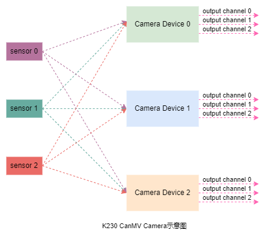

# K230 CanMV Camera 模块API手册


版权所有©2023北京嘉楠捷思信息技术有限公司

<div style="page-break-after:always"></div>

## 免责声明

您购买的产品、服务或特性等应受北京嘉楠捷思信息技术有限公司（“本公司”，下同）及其关联公司的商业合同和条款的约束，本文档中描述的全部或部分产品、服务或特性可能不在您的购买或使用范围之内。除非合同另有约定，本公司不对本文档的任何陈述、信息、内容的正确性、可靠性、完整性、适销性、符合特定目的和不侵权提供任何明示或默示的声明或保证。除非另有约定，本文档仅作为使用指导参考。

由于产品版本升级或其他原因，本文档内容将可能在未经任何通知的情况下，不定期进行更新或修改。

## 商标声明

、“嘉楠”和其他嘉楠商标均为北京嘉楠捷思信息技术有限公司及其关联公司的商标。本文档可能提及的其他所有商标或注册商标，由各自的所有人拥有。

**版权所有 © 2023北京嘉楠捷思信息技术有限公司。保留一切权利。**
非经本公司书面许可，任何单位和个人不得擅自摘抄、复制本文档内容的部分或全部，并不得以任何形式传播。

<div style="page-break-after:always"></div>

## 目录

[TOC]

## 前言

### 概述

本文档主要介绍K230 CanMV平台Camera模块 API使用说明及应用示例。

### 读者对象

本文档（本指南）主要适用于以下人员：

- 技术支持工程师
- 软件开发工程师

### 缩略词定义

| 简称 | 说明 |
| ---- | ---- |
| XXX  | xx   |
| XXX  | xx   |

### 修订记录

| 文档版本号 | 修改说明 | 修改者     | 日期       |
| ---------- | -------- | ---------- | ---------- |
| V1.0       | 初版     | 汪成根    | 2023-09-18 |
| V1.1       |          |            |            |
| V1.2       |          |            |            |

## 1. 概述

​        K230 CanMV平台Camera模块负责图像采集处理任务。本模块提供了一系列Highe Levl的API，应用开发者可以不用关注底层硬件细节，仅通过该模块提供的API即可获取不同格式和尺寸的图像。

​        K230 CanMV平台Camera模块包括三个独立的能力完全相同的camera设备，每个camera设备均可独立完成图像数据采集捕获处理，并可以同时输出3路图像数据。如下图所示：



sensor 0，sensor 1，sensor 2表示三个图像传感器；Camera Device 0，Camera Device 1，Camera Device 2表示三个camera设备；output channel 0，output channel 1，output channel 2表示camera设备的三个输出通道。三个图像传感器可以通过软件配置映射到不同的camera 设备。

## 2. API描述

K230 CanMV平台Camera模块提供camera静态类，该类提供以下章节描述的方法。

### 2.1 sensor_init

【描述】

根据指定的camera设备和sensor类型执行初始化

【语法】

```python
def sensor_init(cls, dev_num, type)
```

【参数】

| 参数名称        | 描述                          | 输入/输出 |
|-----------------|-------------------------------|-----------|
| dev_num | camera设备号 |  |
| sensor_type | sensor类型，CanMV平台定义的已经支持的各类sensor | 输入      |

【返回值】

| 返回值  | 描述                            |
|---------|---------------------------------|
| 0       | 成功。                          |
| 非 0    | 失败，其值为\[错误码\] |

【注意】
这是使用camera模块需要调用的第一个方法。

用户不调用该方法，默认初始化camera设备0及sensor OV5647

【举例】

```python
# 初始化camera设备0以及sensor OV5647
camera.sensor_init(CAM_DEV_ID_0, CAM_DEFAULT_SENSOR)
```

【相关主题】

无

### 2.2 set_inbufs

【描述】

设置指定camera设备使用的输入缓冲区个数

【语法】

```python
def set_inbufs(cls, dev_num, num)
```

【参数】

| 参数名称 | 描述           | 输入/输出 |
| -------- | -------------- | --------- |
| dev_num  | camera设备号   | 输入      |
| num      | 输入缓冲区个数 | 输入      |

【返回值】

| 返回值 | 描述                   |
| ------ | ---------------------- |
| 0      | 成功。                 |
| 非 0   | 失败，其值为\[错误码\] |

【注意】
该方法仅在用户需要同时使用多个camera设备捕获图像时才有效。

当用户使用多个camera设备而不调用该方法时，将使用默认配置参数。这有可能存在默认配置输入缓冲区个数较少而引起丢帧问题。

【举例】

```python
# 配置camera设备0 使用4个输入缓冲区
camera.set_inbufs(CAM_DEV_ID_0，4)

# 配置camera设备1 使用6个输入缓冲区
camera.set_inbufs(CAM_DEV_ID_1，6)
```

【相关主题】

无

### 2.3 set_outbufs

【描述】

设置指定camera设备和通道的输出缓冲区个数

【语法】

```python
def set_outbufs(cls, dev_num, chn_num, num)
```

【参数】

| 参数名称 | 描述             | 输入/输出 |
| -------- | ---------------- | --------- |
| dev_num  | camera设备号     | 输入      |
| chn_num  | camera输出通道号 | 输入      |
| num      | 输出缓冲区个数   | 输入      |

【返回值】

| 返回值 | 描述                   |
| ------ | ---------------------- |
| 0      | 成功。                 |
| 非 0   | 失败，其值为\[错误码\] |

【注意】
如果用户不调用方法，将使用默认配置。

【举例】

```python
# 配置camera设备0,输出通道0, 使用4个输出缓冲区
camera.set_outbufs(CAM_DEV_ID_0, CAM_CHN_ID_0, 4)

# 配置camera设备0,输出通道1, 使用4个输出缓冲区
camera.set_outbufs(CAM_DEV_ID_0, CAM_CHN_ID_1, 4)
```

【相关主题】

无

### 2.4 set_outsize

【描述】

设置指定camera设备和通道的输出图像尺寸

【语法】

```python
def set_outsize(cls, dev_num, chn_num, width, height)
```

【参数】

| 参数名称 | 描述             | 输入/输出 |
| -------- | ---------------- | --------- |
| dev_num  | camera设备号     | 输入      |
| chn_num  | camera输出通道号 | 输入      |
| width    | 输出图像宽度     | 输入      |
| height   | 输出图像高度     | 输入      |

【返回值】

| 返回值 | 描述                   |
| ------ | ---------------------- |
| 0      | 成功。                 |
| 非 0   | 失败，其值为\[错误码\] |

【注意】

输出图像尺寸不能超过输入图像尺寸。

不同输出通道最大可输出图像尺寸由硬件限制。

用户不调用该方法，默认输出图像尺寸与输入图像一致。

【举例】

```python
# 配置camera设备0,输出通道0, 输出图尺寸为640x480
camera.set_outsize(CAM_DEV_ID_0, CAM_CHN_ID_0, 640, 480)

# 配置camera设备0,输出通道1, 输出图尺寸为320x240
camera.set_outsize(CAM_DEV_ID_0, CAM_CHN_ID_1, 320, 240)
```

【相关主题】

无

### 2.5 set_outfmt

【描述】

设置指定camera设备和通道的输出图像格式

【语法】

```python
def set_outfmt(cls, dev_num, chn_num, pix_format)
```

【参数】

| 参数名称   | 描述             | 输入/输出 |
| ---------- | ---------------- | --------- |
| dev_num    | camera设备号     | 输入      |
| chn_num    | camera输出通道号 | 输入      |
| pix_format | 输出图像格式     | 输入      |

【返回值】

| 返回值 | 描述                   |
| ------ | ---------------------- |
| 0      | 成功。                 |
| 非 0   | 失败，其值为\[错误码\] |

【注意】
用户不调用方法，将使用默认配置。

【举例】

```python
# 配置camera设备0,输出通道0, 输出NV12格式
camera.set_outfmt(CAM_DEV_ID_0, CAM_CHN_ID_0, CAM_OUT_NV12)

# 配置camera设备0,输出通道1, 输出RGB888格式
camera.set_outfmt(CAM_DEV_ID_0, CAM_CHN_ID_1, CAM_OUT_RGB888)
```

【相关主题】

无

### 2.5 start_stream

【描述】

启动camera数据流

【语法】

```python
def start_stream(cls, dev_num)
```

【参数】

| 参数名称 | 描述         | 输入/输出 |
| -------- | ------------ | --------- |
| dev_num  | camera设备号 | 输入      |

【返回值】

| 返回值 | 描述                   |
| ------ | ---------------------- |
| 0      | 成功。                 |
| 非 0   | 失败，其值为\[错误码\] |

【注意】
用户不调用方法，将使用默认配置。

【举例】

```python
# 启动camera设备0输出数据流
camera.start_stream(CAM_DEV_ID_0)
```

【相关主题】

无

### 2.6 stop_stream

【描述】

停止camera数据流

【语法】

```python
def stop_stream(cls, dev_num)
```

【参数】

| 参数名称 | 描述         | 输入/输出 |
| -------- | ------------ | --------- |
| dev_num  | camera设备号 | 输入      |

【返回值】

| 返回值 | 描述                   |
| ------ | ---------------------- |
| 0      | 成功。                 |
| 非 0   | 失败，其值为\[错误码\] |

【注意】
用户不调用方法，将使用默认配置。

【举例】

```python
# 停止camera设备0输出数据流
camera.stop_stream(CAM_DEV_ID_0)
```

【相关主题】

无

### 2.7 capture_image

【描述】

从指定camera设备的支持输出通道中捕获一帧图像数据

【语法】

```python
def capture_image(cls, dev_num, chn_num)
```

【参数】

| 参数名称 | 描述             | 输入/输出 |
| -------- | ---------------- | --------- |
| dev_num  | camera设备号     | 输入      |
| chn_num  | camera输出通道号 |           |

【返回值】

| 返回值    | 描述 |
| --------- | ---- |
| image对象 | 成功 |
| 其他      | 失败 |

【注意】

该方法捕获的图像格式由set_outfmt方法指定。

【举例】

```python
# 从camera设备0的通道0输出捕获一帧图像数据
camera.capture_image(CAM_DEV_ID_0， CAM_CHN_ID_0)
```

【相关主题】

无

## 3. 数据结构描述

K230 CanMV平台Camera模块包含如下描述的各个数据定义。

### 3.1 sensor类型

【说明】

示例数据结结构

【定义】

```python
CAM_OV9732_1280X720_30FPS_10BIT_LINEAR = 0

CAM_OV9286_1280X720_30FPS_10BIT_LINEAR_IR = 1
CAM_OV9286_1280X720_30FPS_10BIT_LINEAR_SPECKLE = 2

CAM_OV9286_1280X720_60FPS_10BIT_LINEAR_IR = 3
CAM_OV9286_1280X720_60FPS_10BIT_LINEAR_SPECKLE = 4

CAM_OV9286_1280X720_30FPS_10BIT_LINEAR_IR_SPECKLE = 5
CAM_OV9286_1280X720_60FPS_10BIT_LINEAR_IR_SPECKLE = 6


CAM_IMX335_2LANE_1920X1080_30FPS_12BIT_LINEAR = 7
CAM_IMX335_2LANE_2592X1944_30FPS_12BIT_LINEAR = 8
CAM_IMX335_4LANE_2592X1944_30FPS_12BIT_LINEAR = 9
CAM_IMX335_2LANE_1920X1080_30FPS_12BIT_USEMCLK_LINEAR = 10
CAM_IMX335_2LANE_2592X1944_30FPS_12BIT_USEMCLK_LINEAR = 11
CAM_IMX335_4LANE_2592X1944_30FPS_12BIT_USEMCLK_LINEAR = 12

CAM_IMX335_2LANE_2592X1944_30FPS_10BIT_2HDR = 13
CAM_IMX335_2LANE_2592X1944_30FPS_10BIT_3HDR = 14


CAM_OV5647_1920X1080_30FPS_10BIT_LINEAR = 21
CAM_OV5647_2592x1944_10FPS_10BIT_LINEAR = 22
CAM_OV5647_2592x1944_10FPS_10BIT_LINEAR = 23
CAM_OV5647_1920X1080_30FPS_10BIT_USEMCLK_LINEAR = 24

# the default sensor type
CAM_DEFAULT_SENSOR = CAM_OV5647_1920X1080_30FPS_10BIT_USEMCLK_LINEAR
```

【注意事项】

无

【相关数据类型及接口】

### 3.2 输出图像尺寸

【说明】

定义各个输出通道能够支持的输出图像最大尺寸和最小尺寸

【定义】

```python
CAM_CHN0_OUT_WIDTH_MAX = 3072
CAM_CHN0_OUT_HEIGHT_MAX = 2160

CAM_CHN1_OUT_WIDTH_MAX = 1920
CAM_CHN1_OUT_HEIGHT_MAX = 1080

CAM_CHN2_OUT_WIDTH_MAX = 1920
CAM_CHN2_OUT_HEIGHT_MAX = 1080

CAM_OUT_WIDTH_MIN = 64
CAM_OUT_HEIGHT_MIN = 64
```

【注意事项】

无

【相关数据类型及接口】

## 4. 示例程序

### 例程

```python
# 本示例程序包括以下内容：
# 1. 配置camera设备0同时输出两路图像数据
# 2. 通道0输出YUV格式用于预览显示，通道1输出RGB888P格式用于KPU做人脸检测
# 3. 在while循环中持续调用capture_image方法从通道1捕获RGB888P格式的图像数据
# 4. KPU从捕获数据中检测并输出人脸信息
# 5. 调用image对象的draw方法根据KPU检测到的人脸信息绘制人脸框
# 6. 调用display模块的show_image方法将人脸框信息叠加到预览图像之上
#

import kpu
import display
import image
import camera

CAM_OUTPUT_BUF_NUM = 6
CAM_INPUT_BUF_NUM = 4

out_width = 1080
out_height = 720

out_width = ALIGN_UP(out_width, 16)

# 初始化KPU
interp.Kpu()

# 初始化LCD显示
display.init(HX8377_V2_MIPI_4LAN_1080X1920_30FPS)

# 初始化sensor配置
camera.sensor_init(CAM_DEV_ID_0, CAM_DEFAULT_SENSOR)

# camera.set_inbufs(CAM_DEV_ID_0, CAM_INPUT_BUF_NUM)

###### 配置camera设备0的通道0参数 ######
camera.set_outbufs(CAM_DEV_ID_0, CAM_CHN_ID_0, CAM_OUTPUT_BUF_NUM)
camera.set_outsize(CAM_DEV_ID_0, CAM_CHN_ID_0, out_width, out_height)
camera.set_outfmt(CAM_DEV_ID_0, CAM_CHN_ID_0, PIXEL_FORMAT_YUV_SEMIPLANAR_420)

###### 配置camera设备0的通道1参数 ######
camera.set_outbufs(CAM_DEV_ID_0, CAM_CHN_ID_1, CAM_OUTPUT_BUF_NUM)
camera.set_outsize(CAM_DEV_ID_0, CAM_CHN_ID_1, out_width, out_height)
camera.set_outfmt(CAM_DEV_ID_0, CAM_CHN_ID_1, PIXEL_FORMAT_BGR_888_PLANAR)

# 创建媒体数据链路:camera->display
meida_source = media_device(CAMERA_MOD_ID, CAM_DEV_ID_0, CAM_CHN_ID_0)
meida_sink = media_device(DISPLAY_MOD_ID, DISPLAY_DEV_ID, DISPLAY_CHN_ID_1)
media.create_link(meida_source, meida_sink)

# 设置显示图层
display.set_video_plane(0, 0, out_width, out_height, PIXEL_FORMAT_YVU_PLANAR_420, K_ROTATION_0, K_VO_LAYER1)

# 初始化媒体缓冲区
media.buffer_init()

# 启动camera数据流
camera.start_stream(CAM_DEV_ID_0)

# 以下为获取camera图像并执行人脸检测画框显示的逻辑
count = 0
while count < 100:
    count = count + 1
    # 从camera 设备0的通道1 捕获一帧图像数据(RGB888_PLANAR)
    img = camera.capture_image(CAM_DEV_ID_0, CAM_CHN_ID_1)

    # 基于image对象构造用于KPU处理的data对象
    data = interp.create_tensor(img) # image: datatype, shape, phy_addr

    # 输入data对象
    interp.set_input_tensor(data)

    # KPU执行检测
    interp.run()

    #获取人脸检测结果
    result = interp.get_output_tensor(0) #result: vector? [datatype, shape, addr]

    # 根据检测结果创建一个新的image对象
    img = iamge.draw(result)

    # 显示包含人脸框信息的image
    display.show_image(img, display.DISPLAY_CHN_OSD_3)

# 停止camera数据流
camera.stop_stream(CAM_DEV_ID_0)

# 关闭显示
display.deinit()

# 销毁camera->display媒体数据链路
media.destroy_link(meida_source, meida_sink)

# 去初始化媒体缓冲区
media.buffer_deinit()

```
