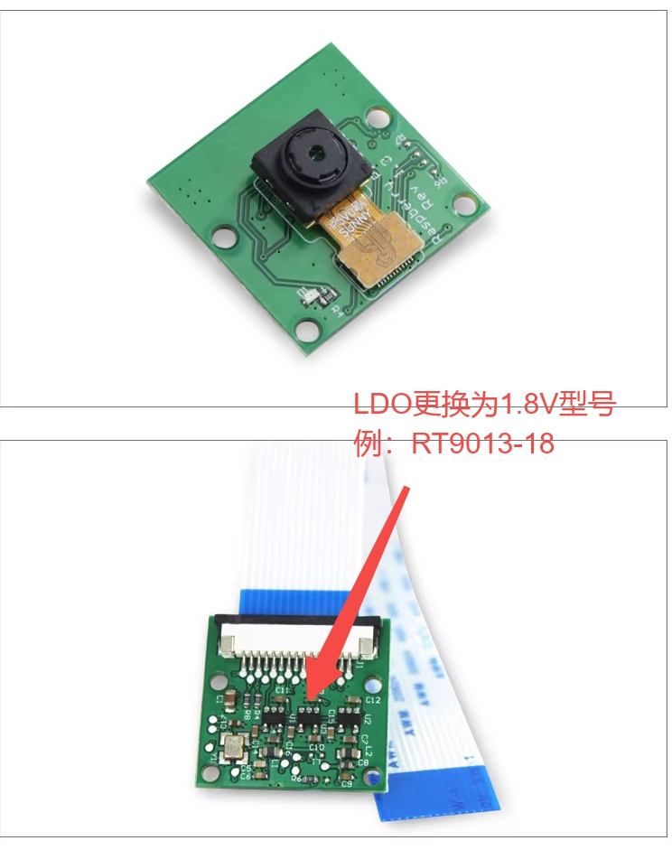

# K230 CanMV Sensor 模块API手册


版权所有©2023北京嘉楠捷思信息技术有限公司

<div style="page-break-after:always"></div>

## 免责声明

您购买的产品、服务或特性等应受北京嘉楠捷思信息技术有限公司（“本公司”，下同）及其关联公司的商业合同和条款的约束，本文档中描述的全部或部分产品、服务或特性可能不在您的购买或使用范围之内。除非合同另有约定，本公司不对本文档的任何陈述、信息、内容的正确性、可靠性、完整性、适销性、符合特定目的和不侵权提供任何明示或默示的声明或保证。除非另有约定，本文档仅作为使用指导参考。

由于产品版本升级或其他原因，本文档内容将可能在未经任何通知的情况下，不定期进行更新或修改。

## 商标声明

、“嘉楠”和其他嘉楠商标均为北京嘉楠捷思信息技术有限公司及其关联公司的商标。本文档可能提及的其他所有商标或注册商标，由各自的所有人拥有。

**版权所有 © 2023北京嘉楠捷思信息技术有限公司。保留一切权利。**
非经本公司书面许可，任何单位和个人不得擅自摘抄、复制本文档内容的部分或全部，并不得以任何形式传播。

<div style="page-break-after:always"></div>

## 目录

[TOC]

## 前言

### 概述

本文档主要介绍K230 CanMV平台Camera模块 API使用说明及应用示例。

### 读者对象

本文档（本指南）主要适用于以下人员：

- 技术支持工程师
- 软件开发工程师

### 缩略词定义

| 简称               | 说明                                                   |
|--------------------|--------------------------------------------------------|
| VICAP              | Video Input Capture，图像输入采集模块                  |
| MCM                | Multi Camera Management ,多摄像头管理                  |

### 修订记录

| 文档版本号 | 修改说明 | 修改者     | 日期       |
| ---------- | -------- | ---------- | ---------- |
| V1.0       | 初版     | 赵忠祥    | 2024-04-24 |

## 1. 概述

K230 CanMV平台sensor模块负责图像采集处理任务。本模块提供了一系列Highe Levl的API，应用开发者可以不用关注底层硬件细节，仅通过该模块提供的API即可获取不同格式和尺寸的图像。

K230 CanMV平台sensor模块包括三个独立的能力完全相同的sensor设备，每个sensor设备均可独立完成图像数据采集捕获处理，并可以同时输出3路图像数据。如下图所示：


sensor 0，sensor 1，sensor 2表示三个图像传感器；Camera Device 0，Camera Device 1，Camera Device 2表示三个sensor设备；output channel 0，output channel 1，output channel 2表示sensor设备的三个输出通道。三个图像传感器可以通过软件配置映射到不同的sensor 设备。

## 2. API描述

K230 CanMV平台sensor模块提供sensor静态类，该类提供以下章节描述的方法。

### 2.1 sensor.reset

【描述】

根据指定的sensor设备和sensor类型执行初始化

【语法】

```python
sensor.reset(dev_num, type)
```

【参数】

| 参数名称        | 描述                          | 输入/输出 |
|-----------------|-------------------------------|-----------|
| dev_num | sensor设备号 |  |
| sensor_type | sensor类型，CanMV平台定义的已经支持的各类sensor | 输入      |

【返回值】

| 返回值  | 描述                            |
|---------|---------------------------------|
| 0       | 成功。                          |
| 非 0    | 失败，其值为\[错误码\] |

sensor_type:

CAM_DEFAULT_SENSOR/OV_OV5647_MIPI_CSI0_1920X1080_30FPS_10BIT_LINEAR

CAM_OV5647_1920X1080_CSI1_30FPS_10BIT_USEMCLK_LINEAR/OV_OV5647_MIPI_CSI1_1920X1080_30FPS_10BIT_LINEAR

CAM_OV5647_1920X1080_CSI2_30FPS_10BIT_USEMCLK_LINEAR/OV_OV5647_MIPI_CSI2_1920X1080_30FPS_10BIT_LINEAR

【注意】
这是使用sensor模块需要调用的第一个方法。

用户不调用该方法，默认初始化sensor设备0及sensor OV5647

【举例】

```python
# 初始化sensor设备0以及sensor OV5647
sensor.reset(CAM_DEV_ID_0, CAM_DEFAULT_SENSOR)
```

【相关主题】

无

### 2.2 sensor.set_framesize

【描述】

设置指定sensor设备和通道的输出图像尺寸

【语法】

```python
sensor.set_framesize(dev_num, chn_num, width, height)
```

【参数】

| 参数名称 | 描述             | 输入/输出 |
| -------- | ---------------- | --------- |
| dev_num  | sensor设备号     | 输入      |
| chn_num  | sensor输出通道号 | 输入      |
| width    | 输出图像宽度     | 输入      |
| height   | 输出图像高度     | 输入      |

【返回值】

| 返回值 | 描述                   |
| ------ | ---------------------- |
| 0      | 成功。                 |
| 非 0   | 失败，其值为\[错误码\] |

【注意】

输出图像尺寸不能超过输入图像尺寸。

不同输出通道最大可输出图像尺寸由硬件限制。

用户不调用该方法，默认输出图像尺寸与输入图像一致。

【举例】

```python
# 配置sensor设备0,输出通道0, 输出图尺寸为640x480
sensor.set_framesize(CAM_DEV_ID_0, CAM_CHN_ID_0, 640, 480)

# 配置sensor设备0,输出通道1, 输出图尺寸为320x240
sensor.set_framesize(CAM_DEV_ID_0, CAM_CHN_ID_1, 320, 240)
```

【相关主题】

无

### 2.3 sensor.set_pixformat

【描述】

设置指定sensor设备和通道的输出图像格式

【语法】

```python
sensor.set_pixformat(dev_num, chn_num, pix_format)
```

【参数】

| 参数名称   | 描述             | 输入/输出 |
| ---------- | ---------------- | --------- |
| dev_num    | sensor设备号     | 输入      |
| chn_num    | sensor输出通道号 | 输入      |
| pix_format | 输出图像格式     | 输入      |

pix_format:

sensor.YUV420SP: NV12

sensor.RGB888: RGB888 interleave

sensor.RGB888P: RGB888 planer

【返回值】

| 返回值 | 描述                   |
| ------ | ---------------------- |
| 0      | 成功。                 |
| 非 0   | 失败，其值为\[错误码\] |

【注意】
用户不调用方法，将使用默认配置。

【举例】

```python
# 配置sensor设备0,输出通道0, 输出NV12格式
sensor.set_pixformat(CAM_DEV_ID_0, CAM_CHN_ID_0, sensor.YUV420SP)

# 配置sensor设备0,输出通道1, 输出RGB888格式
sensor.set_pixformat(CAM_DEV_ID_0, CAM_CHN_ID_1, sensor.RGB888)
```

【相关主题】

无

### 2.4 sensor.start_stream

【描述】

启动sensor数据流

【语法】

```python
sensor.start_stream()
```

【参数】

【返回值】

| 返回值 | 描述                   |
| ------ | ---------------------- |
| 0      | 成功。                 |
| 非 0   | 失败，其值为\[错误码\] |

【举例】

```python
# 启动sensor设备输出数据流
sensor.start_stream()
```

【相关主题】

无

### 2.5 sensor.stop_stream

【描述】

停止sensor数据流

【语法】

```python
sensor.stop_stream()
```

【参数】

【返回值】

| 返回值 | 描述                   |
| ------ | ---------------------- |
| 0      | 成功。                 |
| 非 0   | 失败，其值为\[错误码\] |

【举例】

```python
# 停止sensor设备0输出数据流
sensor.stop_stream(CAM_DEV_ID_0)
```

【相关主题】

无

### 2.6 sensor.snapshot

【描述】

从指定sensor设备的支持输出通道中捕获一帧图像数据

【语法】

```python
sensor.snapshot(dev_num, chn_num)
```

【参数】

| 参数名称 | 描述             | 输入/输出 |
| -------- | ---------------- | --------- |
| dev_num  | sensor设备号     | 输入      |
| chn_num  | sensor输出通道号 |           |

【返回值】

| 返回值    | 描述 |
| --------- | ---- |
| image对象 | 成功 |
| 其他      | 失败 |

【注意】

该方法捕获的图像格式由set_outfmt方法指定。

【举例】

```python
# 从sensor设备0的通道0输出捕获一帧图像数据
sensor.snapshot(CAM_DEV_ID_0， CAM_CHN_ID_0)
```

【相关主题】

无

## 3. 数据结构描述

K230 CanMV平台Camera模块包含如下描述的各个数据定义。

### 3.1 sensor类型

【说明】

下面是目前Canmv-K230板micropython支持的Sensor。
其中CSI1/2是可以使用树莓派的ov5647模组，如果使用Canmv-K230 V1.0/1.1版的板子，要修改该模组的电压。

【定义】

```python
CAM_IMX335_2LANE_1920X1080_30FPS_12BIT_USEMCLK_LINEAR                   # Imx335 CSI0
CAM_OV5647_1920X1080_30FPS_10BIT_USEMCLK_LINEAR                         # OV5647 CSI0
CAM_OV5647_1920X1080_CSI1_30FPS_10BIT_USEMCLK_LINEAR                    # OV5647 CSI1
CAM_OV5647_1920X1080_CSI2_30FPS_10BIT_USEMCLK_LINEAR                    # OV5647 CSI2
# the default sensor type
CAM_DEFAULT_SENSOR = CAM_OV5647_1920X1080_30FPS_10BIT_USEMCLK_LINEAR    # 默认的sensor使用OV5647 CSI0
```

【注意事项】

Canmv-K230 V1.0/1.1版的板子外设接口为1.8V，不能直接使用树莓派的ov5647模组，必须修改电压为1.8V。



【相关数据类型及接口】

### 3.2 输出图像尺寸

【说明】

定义各个输出通道能够支持的输出图像最大尺寸和最小尺寸

【定义】

```python
CAM_CHN0_OUT_WIDTH_MAX = 3072
CAM_CHN0_OUT_HEIGHT_MAX = 2160

CAM_CHN1_OUT_WIDTH_MAX = 1920
CAM_CHN1_OUT_HEIGHT_MAX = 1080

CAM_CHN2_OUT_WIDTH_MAX = 1920
CAM_CHN2_OUT_HEIGHT_MAX = 1080

CAM_OUT_WIDTH_MIN = 64
CAM_OUT_HEIGHT_MIN = 64
```

【注意事项】

无

【相关数据类型及接口】

## 4. 示例程序

### 例程

```python
# 本示例程序包括以下内容：
# 1. 配置sensor设备0同时输出三路图像数据
# 2. 通道0输出YUV格式用于预览显示，通道1、2输出RGB888P
# 3. 抓取三路输出的图像各100张
#

from media.sensor import * #导入sensor模块，使用sensor相关接口
from media.display import * #导入display模块，使用display相关接口
from media.media import * #导入media模块，使用meida相关接口
from time import * #导入time模块，使用time相关接口
import time
import image #导入image模块，使用image相关接口

def canmv_sensor_test():
    print("canmv_sensor_test")

    #初始化HDMI显示
    display.init(LT9611_1920X1080_30FPS)

    #初始化默认sensor配置（OV5647）
    sensor.reset(CAM_DEV_ID_0, CAM_DEFAULT_SENSOR)

    out_width = 1920
    out_height = 1080
    # 设置输出宽度16字节对齐
    out_width = ALIGN_UP(out_width, 16)

    #设置通道0输出尺寸
    sensor.set_framesize(CAM_DEV_ID_0, CAM_CHN_ID_0, out_width, out_height)
    #设置通道0输出格式
    sensor.set_pixformat(CAM_DEV_ID_0, CAM_CHN_ID_0, PIXEL_FORMAT_YUV_SEMIPLANAR_420)

    #创建媒体数据源设备
    media_source = media_device(CAMERA_MOD_ID, CAM_DEV_ID_0, CAM_CHN_ID_0)
    #创建媒体数据接收设备
    media_sink = media_device(DISPLAY_MOD_ID, DISPLAY_DEV_ID, DISPLAY_CHN_VIDEO1)
    #创建媒体链路，数据从源设备流到接收设备
    media.create_link(media_source, media_sink)
    #设置显示输出平面的属性
    display.set_plane(0, 0, out_width, out_height, PIXEL_FORMAT_YVU_PLANAR_420, DISPLAY_MIRROR_NONE, DISPLAY_CHN_VIDEO1)

    out_width = 640
    out_height = 480
    out_width = ALIGN_UP(out_width, 16)

    #设置通道1输出尺寸
    sensor.set_framesize(CAM_DEV_ID_0, CAM_CHN_ID_1, out_width, out_height)
    #设置通道1输出格式
    sensor.set_pixformat(CAM_DEV_ID_0, CAM_CHN_ID_1, PIXEL_FORMAT_RGB_888)

    #设置通道2输出尺寸
    sensor.set_framesize(CAM_DEV_ID_0, CAM_CHN_ID_2, out_width, out_height)
    #设置通道2输出格式
    sensor.set_pixformat(CAM_DEV_ID_0, CAM_CHN_ID_2, PIXEL_FORMAT_RGB_888_PLANAR)

    #初始化媒体缓冲区
    ret = media.buffer_init()
    if ret:
        print("canmv_sensor_test, buffer init failed")
        return ret

    #启动摄像头数据流
    sensor.start_stream(CAM_DEV_ID_0)
    time.sleep(15)

    capture_count = 0
    while capture_count < 100:
        time.sleep(1)
        for dev_num in range(CAM_DEV_ID_MAX):
            if not sensor.cam_dev[dev_num].dev_attr.dev_enable:
                continue

            for chn_num in range(CAM_CHN_ID_MAX):
                if not sensor.cam_dev[dev_num].chn_attr[chn_num].chn_enable:
                    continue

                print(f"canmv_sensor_test, dev({dev_num}) chn({chn_num}) capture frame.")
                #从指定设备和通道捕获图像
                img = sensor.capture_image(dev_num, chn_num)
                if img == -1:
                    print("sensor.capture_image failed")
                    continue

                if img.format() == image.YUV420:
                    suffix = "yuv420sp"
                elif img.format() == image.RGB888:
                    suffix = "rgb888"
                elif img.format() == image.RGBP888:
                    suffix = "rgb888p"
                else:
                    suffix = "unkown"

                filename = f"/sdcard/dev_{dev_num:02d}_chn_{chn_num:02d}_{img.width()}x{img.height()}_{capture_count:04d}.{suffix}"
                print("save capture image to file:", filename)

                with open(filename, "wb") as f:
                    if f:
                        img_data = uctypes.bytearray_at(img.virtaddr(), img.size())
                        # save yuv data to sdcard.
                        #f.write(img_data)
                    else:
                        print(f"capture_image, open dump file failed({filename})")

                time.sleep(1)
                #释放捕获的图像数据
                sensor.release_image(dev_num, chn_num, img)

                capture_count += 1

    #停止摄像头输出
    sensor.stop_stream(CAM_DEV_ID_0)

    #去初始化显示设备
    display.deinit()

    #销毁媒体链路
    media.destroy_link(media_source, media_sink)

    time.sleep(1)
    #去初始化媒体缓冲区资源
    ret = media.buffer_deinit()
    if ret:
        print("sensor test, media_buffer_deinit failed")
        return ret

    print("sensor test exit")
    return 0


canmv_sensor_test()
```
