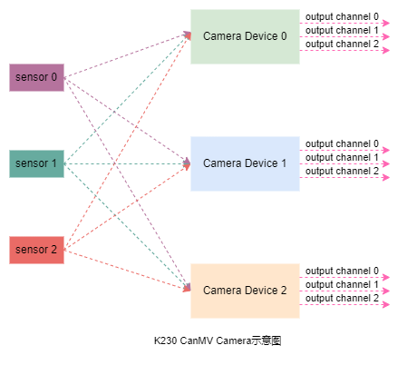

# `Sensor` 模块 API 手册

```{attention}
该模块自固件版本 V0.7 起发生了较大改动，若使用 V0.7 之前的固件，请参考旧版本文档。
```

## 概述

CanMV K230 平台的 `sensor` 模块负责图像采集与数据处理。该模块提供了一套高级 API，开发者可以利用这些接口轻松获取不同格式与尺寸的图像，而无需了解底层硬件的具体实现。其架构如下图所示：



图中，sensor 0、sensor 1 和 sensor 2 分别代表三个图像输入传感器设备；Camera Device 0、Camera Device 1 和 Camera Device 2 对应相应的图像处理单元；output channel 0、output channel 1 和 output channel 2 表示每个图像处理单元最多支持三个输出通道。通过软件配置，不同的传感器设备可以灵活映射到相应的图像处理单元。

CanMV K230 的 `sensor` 模块最多支持三路图像传感器的同时接入，每一路均可独立完成图像数据的采集、捕获和处理。此外，每个视频通道可并行输出三路图像数据供后端模块进行进一步处理。实际应用中，具体支持的传感器数量、输入分辨率和输出通道数将受限于开发板的硬件配置和内存大小，因此需根据项目需求进行综合评估。

## API 介绍

### 构造函数

**描述**

通过 `csi id` 和图像传感器类型构建 `Sensor` 对象。

在图像处理应用中，用户通常需要首先创建一个 `Sensor` 对象。CanMV K230 软件可以自动检测内置的图像传感器，无需用户手动指定具体型号，只需设置传感器的最大输出分辨率和帧率。有关支持的图像传感器信息，请参见[图像传感器支持列表](#图像传感器支持列表)。如果设定的分辨率或帧率与当前传感器的默认配置不符，系统会自动调整为最优配置，最终的配置可在日志中查看，例如 `use sensor 23, output 640x480@90`。

**语法**

```python
sensor = Sensor(id, [width, height, fps])
```

**参数**

| 参数名称 | 描述                              | 输入/输出 | 说明                          |
|----------|-----------------------------------|-----------|-------------------------------|
| id       | `csi` 端口，支持 `0-2`，具体端口请参考硬件原理图 | 输入      | 可选，不同型号开发板的默认值不同 |
| width    | `sensor` 最大输出图像宽度         | 输入      | 可选，默认 `1920`             |
| height   | `sensor` 最大输出图像高度         | 输入      | 可选，默认 `1080`             |
| fps      | `sensor` 最大输出图像帧率         | 输入      | 可选，默认 `30`               |

**返回值**

| 返回值     | 描述                  |
|------------|-----------------------|
| Sensor 对象 | 传感器对象            |

**举例**

```python
sensor = Sensor(id=0)
sensor = Sensor(id=0, width=1280, height=720, fps=60)
sensor = Sensor(id=0, width=640, height=480)
```

### sensor.reset

**描述**

复位 `sensor` 对象。在构造 `Sensor` 对象后，必须调用此函数以继续执行其他操作。

**语法**

```python
sensor.reset()
```

**参数**

| 参数名称 | 描述 | 输入/输出 |
|----------|------|-----------|
| 无       |      |           |

**返回值**

| 返回值 | 描述 |
|--------|------|
| 无     |      |

**举例**

```python
# 初始化 sensor 设备 0 以及传感器 OV5647
sensor.reset()
```

### sensor.set_framesize

**描述**

设置指定通道的输出图像尺寸。用户可以通过 `framesize` 参数或直接指定 `width` 和 `height` 来配置输出图像尺寸。**宽度会自动对齐到 16 像素宽**。

**语法**

```python
sensor.set_framesize(framesize=FRAME_SIZE_INVALID, chn=CAM_CHN_ID_0, alignment=0, crop = None,  **kwargs)
```

**参数**

| 参数名称 | 描述              | 输入/输出 |
|----------|-------------------|-----------|
| framesize| sensor 输出图像尺寸 | 输入      |
| chn      | sensor 输出通道号   | 输入      |
| width    | 输出图像宽度，*kw_arg*  | 输入      |
| height   | 输出图像高度，*kw_arg*  | 输入      |
| crop     | 输出图像裁剪区域;<br> 当输入为 `crop`=`True` 时，从画面中心自动裁切出合适的区域;<br>当输入 `crop` 为 `(crop_x, crop_y, crop_w, crop_h)` 时, `crop_x` 和 `crop_y` 为裁剪区域的左上角坐标，`crop_w` 和 `crop_h` 为裁剪区域的宽度和高度; | 输入      |

**返回值**

| 返回值 | 描述 |
|--------|------|
| 无     |      |

**注意事项**

- 输出图像尺寸不得超过图像传感器的实际输出能力。
- 各通道的最大输出图像尺寸受硬件限制。

**举例**

```python
# 配置 sensor 设备 0，输出通道 0，输出图尺寸为 640x480
sensor.set_framesize(chn=CAM_CHN_ID_0, width=640, height=480)

# 配置 sensor 设备 0，输出通道 1，输出图尺寸为 320x240
sensor.set_framesize(chn=CAM_CHN_ID_1, width=320, height=240)
```

### sensor.set_pixformat

**描述**

配置指定通道的图像传感器输出图像格式。

**语法**

```python
sensor.set_pixformat(pix_format, chn=CAM_CHN_ID_0)
```

**参数**

| 参数名称   | 描述              | 输入/输出 |
|------------|-------------------|-----------|
| pix_format | 输出图像格式       | 输入      |
| chn        | sensor 输出通道号  | 输入      |

**返回值**

| 返回值 | 描述 |
|--------|------|
| 无     |      |

**举例**

```python
# 配置 sensor 设备 0，输出通道 0，输出 NV12 格式
sensor.set_pixformat(sensor.YUV420SP, chn=CAM_CHN_ID_0)

# 配置 sensor 设备 0，输出通道 1，输出 RGB888 格式
sensor.set_pixformat(sensor.RGB888, chn=CAM_CHN_ID_1)
```

### sensor.set_hmirror

**描述**

配置图像传感器是否进行水平镜像。

**语法**

```python
sensor.set_hmirror(enable)
```

**参数**

| 参数名称 | 描述                                    | 输入/输出 |
|----------|-----------------------------------------|-----------|
| enable   | `True` 开启水平镜像功能<br>`False` 关闭水平镜像功能 | 输入      |

**返回值**

| 返回值 | 描述 |
|--------|------|
| 无     |      |

**举例**

```python
sensor.set_hmirror(True)
```

### sensor.set_vflip

**描述**

配置图像传感器是否进行垂直翻转。

**语法**

```python
sensor.set_vflip(enable)
```

**参数**

| 参数名称 | 描述                                    | 输入/输出 |
|----------|-----------------------------------------|-----------|
| enable   | `True` 开启垂直翻转功能<br>`False` 关闭垂直翻转功能 | 输入      |

**返回值**

| 返回值 | 描述 |
|--------|------|
| 无     |      |

**举例**

```python
sensor.set_vflip(True)
```

### sensor.run

**描述**

启动图像传感器的输出。**必须在调用 `MediaManager.init()` 之后执行此操作。**

**语法**

```python
sensor.run()
```

**返回值**

| 返回值 | 描述 |
|--------|------|
| 无     |      |

**注意事项**

- 当同时使用多个传感器（最多 3 个）时，仅需其中一个执行 `run` 即可。

**举例**

```python
# 启动 sensor 设备输出数据流
sensor.run()
```

### sensor.stop

**描述**

停止图像传感器输出。**必须在 `MediaManager.deinit()` 之前调用此方法。**

**语法**

```python
sensor.stop()
```

**返回值**

| 返回值 | 描述 |
|--------|------|
| 无     |      |

**注意事项**

- 如果同时使用多个图像传感器（最多 3 个），**每个传感器都需单独调用 `stop`**。

**举例**

```python
# 停止 sensor 设备 0 的数据流输出
sensor.stop()
```

### sensor.snapshot

**描述**

从指定输出通道中捕获一帧图像数据。

**语法**

```python
sensor.snapshot(chn=CAM_CHN_ID_0, timeout = 1000, dump_frame = False)
```

**参数**

| 参数名称 | 描述              | 输入/输出 |
|----------|-------------------|-----------|
| chn      | sensor 输出通道号  | 输入      |
| timeout  | sensor 获取一帧超时时间， 默认 1000 ms | 输入 |
| dump_frame | 如果为 True 返回 py_video_frame_info, 否则返回 Image | 输入 |

**返回值**

| 返回值    | 描述            |
|-----------|-----------------|
| image 对象 或 py_video_frame_info | 捕获的图像数据  |
| 其他      | 捕获失败        |

**举例**

```python
# 从 sensor 设备 0 的通道 0 捕获一帧图像数据
sensor.snapshot()
```

### sensor.bind_info

**描述**

获取传感器通道的绑定信息，用于与其他模块（如显示模块）进行绑定。

**语法**

```python
sensor.bind_info(x=0, y=0, chn=CAM_CHN_ID_0)
```

**参数**

| 参数名称 | 描述                   | 输入/输出 |
|----------|------------------------|-----------|
| x        | 绑定区域的水平起始坐标 | 输入      |
| y        | 绑定区域的垂直起始坐标 | 输入      |
| chn      | 传感器输出通道号       | 输入      |

**返回值**

| 返回值       | 描述                                 |
|--------------|--------------------------------------|
| dict 对象    | 包含通道的源信息、区域尺寸和像素格式 |

**举例**

```python
# 获取传感器通道0的绑定信息
info = sensor.bind_info(chn=CAM_CHN_ID_0)
print(info)  # 输出如 {'src': (0, 0, 0), 'rect': (0, 0, 640, 480), 'pix_format': 2}
```

### sensor.get_hmirror

**描述**  

获取当前水平镜像功能的启用状态。

**语法**  

```python
sensor.get_hmirror()
```

**返回值**  

| 返回值  | 描述               |
|---------|--------------------|
| bool    | `True` 表示启用，`False` 表示关闭 |

**举例**  

```python
hmirror_enabled = sensor.get_hmirror()
print("水平镜像已启用:", hmirror_enabled)
```

### sensor.get_vflip

**描述**  

获取当前垂直翻转功能的启用状态。

**语法**  

```python
sensor.get_vflip()
```

**返回值**

| 返回值  | 描述               |
|---------|--------------------|
| bool    | `True` 表示启用，`False` 表示关闭 |

**举例**

```python
vflip_enabled = sensor.get_vflip()
print("垂直翻转已启用:", vflip_enabled)
```

### sensor.width

**描述**  

获取指定通道的当前输出图像宽度。

**语法**  

```python
sensor.width(chn=CAM_CHN_ID_0)
```

**参数**  

| 参数名称 | 描述              | 输入/输出 |
|----------|-------------------|-----------|
| chn      | 传感器输出通道号  | 输入      |

**返回值**  

| 返回值  | 描述        |
|---------|-------------|
| int     | 图像宽度（像素） |

**举例**  

```python
current_width = sensor.width(chn=CAM_CHN_ID_0)
print("当前宽度:", current_width)
```

### sensor.height

**描述**  

获取指定通道的当前输出图像高度。

**语法**  

```python
sensor.height(chn=CAM_CHN_ID_0)
```

**参数**  

| 参数名称 | 描述              | 输入/输出 |
|----------|-------------------|-----------|
| chn      | 传感器输出通道号  | 输入      |

**返回值**  

| 返回值  | 描述        |
|---------|-------------|
| int     | 图像高度（像素） |

**举例**  

```python
current_height = sensor.height(chn=CAM_CHN_ID_0)
print("当前高度:", current_height)
```

### sensor.get_pixformat

**描述**  

获取指定通道的当前像素格式。

**语法**  

```python
sensor.get_pixformat(chn=CAM_CHN_ID_0)
```

**参数**  

| 参数名称 | 描述              | 输入/输出 |
|----------|-------------------|-----------|
| chn      | 传感器输出通道号  | 输入      |

**返回值**  

| 返回值     | 描述           |
|------------|----------------|
| int        | 像素格式枚举值（如 `sensor.RGB888`） |

**举例**  

```python
current_format = sensor.get_pixformat(chn=CAM_CHN_ID_0)
print("当前像素格式:", current_format)
```

### sensor.get_type

**描述**  
获取当前传感器的类型标识符。

**语法**  

```python
sensor.get_type()
```

**返回值**  

| 返回值     | 描述           |
|------------|----------------|
| int        | 传感器类型枚举值 |

**举例**  

```python
sensor_type = sensor.get_type()
print("传感器类型:", sensor_type)
```

### sensor.again

**描述**  

获取或设置传感器的模拟增益值。

**语法**  

```python
# 获取增益
gain = sensor.again()

# 设置增益（直接传 float 值）
sensor.again(desired_gain)
```

**参数**  

| 参数名称      | 描述                 | 输入/输出 |
|---------------|----------------------|-----------|
| desired_gain  | 目标增益值（设置时使用），直接传入 float 类型 | 输入      |

**返回值**  

| 返回值        | 描述                     |
|---------------|--------------------------|
| k_sensor_gain | 当前增益对象（获取时返回），通过 `.gain[0]` 访问增益值 |
| bool          | 设置成功返回 `True`    |

**注意事项**  

- 仅部分 sensor 支持，如 `sc132gs`
- 设置增益时需确保传感器已初始化且处于运行状态
- 建议先调用 `get_again_range()` 获取增益范围

**举例**  

```python
# 获取当前增益
current_gain = sensor.again()
print("当前增益:", current_gain.gain[0])

# 设置增益为 4.0
sensor.again(4.0)
```

### sensor.auto_focus

**描述**  

获取或设置自动对焦功能的启用状态。  

**语法**  

```python
Sensor.auto_focus(enable = None)
```

**参数**  

| 参数名称 | 描述                 | 输入/输出 |
|----------|----------|-----------|
| enable   | 自动对焦功能的启用状态（设置时使用） | 输入     |

**返回值**  

| 返回值  | 描述               |
|---------|----------|
| bool    | 获取时返回当前状态：`True` 表示启用，`False` 表示关闭；<br>设置时返回操作结果：`True` 表示成功，`False` 表示失败。 |

**举例**  

```python
# 获取自动对焦状态
auto_focus_get = sensor.auto_focus()
print("sensor.auto_focus():", auto_focus_get)

# 设置自动对焦
sensor.auto_focus(True)
```

**注意事项**  

- 仅部分 sensor 支持。
- 自动对焦功能时需在运行之前设置。

### sensor.focus_caps

**描述**  

获取传感器的自动对焦功能及其范围。

**语法**  

```python
focus_caps_tuple = Sensor.focus_caps()
```

**参数**  

无

**返回值**  

| 返回值  | 描述               |
|---------|----------|
| focus_caps_tuple   | 包含自动对焦功能及其范围的元组：`(isSupport, minPos, maxPos)`;<br> `isSupport` 表示是否支持自动对焦功能，`minPos` 表示最小对焦位置，`maxPos` 表示最大对焦位置。 |

**举例**  

```python
# 获取自动对焦功能及其范围
focus_caps_tuple = sensor.focus_caps()
print("focus_caps_tuple:", focus_caps_tuple)
```

### sensor.focus_pos

**描述**  

获取或设置传感器的当前对焦位置。

**语法**  

```python
focus_pos = sensor.focus_pos(pos = None)
```

**参数**  

| 参数名称 | 描述                 | 输入/输出 |
|----------|----------|-----------|
| pos      | 对焦位置（设置时使用） | 输入     |

**返回值**  

| 返回值  | 描述               |
|----------|----------|
| focus_pos | 获取时返回当前对焦位置；<br>设置时返回操作结果：`True` 表示成功，`False` 表示失败。 |

**举例**  

```python
# 获取当前对焦位置
current_focus_pos = sensor.focus_pos()
print("当前对焦位置:", current_focus_pos)

# 设置对焦位置
sensor.focus_pos(300)
```

### sensor.get_exposure_time_range

**描述**

获取传感器支持的曝光时间范围。

**语法**

```python
sensor.get_exposure_time_range()
```

**参数**

无

**返回值**

| 返回值 | 描述 |
|--------|------|
| `tuple` | `(max_exposure_time_us, min_exposure_time_us)` 单位为微秒（us） |
| `None` | 如果获取失败 |

**举例**

```python
from media.sensor import Sensor

sensor = Sensor()
sensor.reset()

# 获取曝光范围
range = sensor.get_exposure_time_range()
if range:
    max_exp, min_exp = range
    print(f"曝光范围：{min_exp:.2f} us - {max_exp:.2f} us")
    print(f"         ({min_exp/1000:.2f} ms - {max_exp/1000:.2f} ms)")
```

**注意事项**

- 返回值单位为微秒（us）
- 不同传感器支持的曝光范围不同
- 建议在设置曝光前先获取范围
- **必须在 `sensor.run()` 之后调用**

---

### sensor.auto_exposure

**描述**

开关自动曝光或获取当前自动曝光状态。

**语法**

```python
# 获取当前状态
status = sensor.auto_exposure()

# 设置状态
sensor.auto_exposure(enable)
```

**参数**

| 参数名称 | 描述 | 输入/输出 |
|----------|------|-----------|
| enable | `True`: 开启自动曝光<br>`False`: 关闭自动曝光（手动模式）<br>`None` 或省略：获取当前状态 | 输入 |

**返回值**

| 返回值 | 描述 |
|--------|------|
| `bool` | 当前自动曝光状态（开启返回 `True`，关闭返回 `False`） |

**异常**

- `RuntimeError`: 如果 sensor 未初始化

**举例**

```python
from media.sensor import Sensor

sensor = Sensor()
sensor.reset()

# 获取当前自动曝光状态
status = sensor.auto_exposure()
print(f"自动曝光：{'开启' if status else '关闭'}")

# 关闭自动曝光（手动模式）- 必须在 run() 之前！
sensor.auto_exposure(False)

# 设置手动曝光时间
sensor.exposure(10000)  # 10ms

# 启动传感器
sensor.run()
```

**注意事项**

- **必须在 `sensor.run()` 之前调用**
- 关闭自动曝光后才能手动设置曝光时间
- 目前不支持在`sensor.run()`之后动态开关自动曝光

---

### sensor.exposure

**描述**

获取或设置传感器曝光时间。

**语法**

```python
# 获取当前曝光时间
current = sensor.exposure()

# 设置曝光时间
sensor.exposure(exposure_us)
```

**参数**

| 参数名称 | 描述 | 输入/输出 |
|----------|------|-----------|
| exposure_us | 曝光时间，单位微秒（us）<br>省略或 `None`: 获取当前曝光时间<br>`float`: 设置为指定曝光时间 | 输入 |

**返回值**

| 返回值 | 描述 |
|--------|------|
| `float` | 当前曝光时间（微秒）|
| `None` | 如果失败 |

**异常**

- `RuntimeError`: 如果 sensor fd 无效

**举例**

```python
from media.sensor import Sensor

sensor = Sensor()
sensor.reset()

# 关闭自动曝光（必须在 run 之前）
sensor.auto_exposure(False)

# 启动传感器
sensor.run()

# 获取当前曝光时间
current = sensor.exposure()
print(f"当前曝光：{current:.2f} us")

# 设置曝光时间为 10ms
sensor.exposure(10000)

# 结合曝光范围使用
range = sensor.get_exposure_time_range()
if range:
    max_exp, min_exp = range
    # 设置为中间值
    mid_exp = (max_exp + min_exp) / 2
    sensor.exposure(mid_exp)
    print(f"设置曝光：{mid_exp:.2f} us")
```

**注意事项**

- **必须在 `sensor.run()` 之后调用**
- 单位统一使用微秒（us）
- 底层自动进行秒↔微秒的转换
- 建议先关闭自动曝光再手动设置
- 设置值应在 `get_exposure_time_range()` 返回的范围内

---

### 完整示例

```python
from media.sensor import Sensor

# 初始化传感器
sensor = Sensor()
sensor.reset()
sensor.set_pixformat(sensor.RGB565)
sensor.set_framesize(sensor.FHD)

# 获取曝光范围（run 之前不能调用）
# range = sensor.get_exposure_time_range()  # 错误！

# 关闭自动曝光（必须在 run 之前）
sensor.auto_exposure(False)

# 启动传感器
sensor.run()

# 现在可以调用 get_exposure_time_range 和 exposure 了
range = sensor.get_exposure_time_range()
if range:
    max_exp, min_exp = range
    print(f"曝光范围：{min_exp:.2f} us - {max_exp:.2f} us")
    
    # 设置为中间曝光值
    mid_exp = (max_exp + min_exp) / 2
    sensor.exposure(mid_exp)
    print(f"设置曝光：{mid_exp:.2f} us")

# 运行中调整曝光
frame_count = 0
while True:
    img = sensor.snapshot()
    
    # 每 100 帧调整一次曝光
    if frame_count % 100 == 0:
        current = sensor.exposure()
        print(f"当前曝光：{current:.2f} us")
    
    frame_count += 1
```

## 数据结构描述

### frame_size

| 图像帧尺寸 | 分辨率       |
|------------|--------------|
| QQCIF      | 88x72        |
| QCIF       | 176x144      |
| CIF        | 352x288      |
| QSIF       | 176x120      |
| SIF        | 352x240      |
| QQVGA      | 160x120      |
| QVGA       | 320x240      |
| VGA        | 640x480      |
| HQQVGA     | 120x80       |
| HQVGA      | 240x160      |
| HVGA       | 480x320      |
| B64X64     | 64x64        |
| B128X64    | 128x64       |
| B128X128   | 128x128      |
| B160X160   | 160x160      |
| B320X320   | 320x320      |
| QQVGA2     | 128x160      |
| WVGA       | 720x480      |
| WVGA2      | 752x480      |
| SVGA       | 800x600      |
| XGA        | 1024x768     |
| WXGA       | 1280x768     |
| SXGA       | 1280x1024    |
| SXGAM      | 1280x960     |
| UXGA       | 1600x1200    |
| HD         | 1280x720     |
| FHD        | 1920x1080    |
| QHD        | 2560x1440    |
| QXGA       | 2048x1536    |
| WQXGA      | 2560x1600    |
| WQXGA2     | 2592x1944    |

### pixel_format

| 像素格式  | 说明         |
|-----------|--------------|
| RGB565    | 16 位 RGB 格式 |
| RGB888    | 24 位 RGB 格式 |
| RGBP888   | 分离的 24 位 RGB |
| YUV420SP  | 半平面 YUV  |
| GRAYSCALE | 灰度图       |

### channel

| 通道号      | 说明     |
|-------------|----------|
| CAM_CHN_ID_0 | 通道 0  |
| CAM_CHN_ID_1 | 通道 1  |
| CAM_CHN_ID_2 | 通道 2  |
| CAM_CHN_ID_MAX | 非法通道 |

## 图像传感器支持列表

| 图像传感器型号 | 分辨率<br>Width x Height | 帧率   |
|----------------|---------------------------|--------|
| OV5647         | 2592x1944                 | 10 FPS |
|                | 1920x1080                 | 30 FPS |
|                | 1280x960                  | 45 FPS |
|                | 1280x720                  | 60 FPS |
|                | 640x480                   | 90 FPS |
| GC2093         | 1920x1080                 | 30 FPS |
|                | 1920x1080                 | 60 FPS |
|                | 1280x960                  | 60 FPS |
|                | 1280x720                  | 90 FPS |
| IMX335         | 1920x1080                 | 30 FPS |
|                | 2592x1944                 | 30 FPS |

---

### sensor.get_again_range

**描述**

获取传感器模拟增益（Again）的可设置范围。

**语法**

```python
sensor.get_again_range()
```

**参数**

无

**返回值**

| 返回值 | 描述 |
|--------|------|
| `dict` | 包含增益范围信息的字典：<br>- `min`: 最小增益<br>- `max`: 最大增益<br>- `step`: 增益步进值 |
| `None` | 如果获取失败 |

**注意事项**

- 仅部分 sensor 支持
- 必须在 `sensor.run()` 之后调用
- 建议在设置增益前先获取范围

**举例**

```python
from media.sensor import Sensor

sensor = Sensor()
sensor.reset()
sensor.run()

# 获取增益范围
gain_range = sensor.get_again_range()
if gain_range:
    min_gain = gain_range['min']
    max_gain = gain_range['max']
    step = gain_range['step']
    print(f"增益范围：{min_gain:.2f} - {max_gain:.2f}")
    print(f"步进值：{step:.6f}")
    
    # 设置增益为中间值
    mid_gain = (min_gain + max_gain) / 2
    sensor.again(mid_gain)
```

---

### Sensor.list_mode

**描述**

列出指定传感器支持的所有分辨率和 FPS 组合。**这是静态方法，无需初始化传感器即可调用。**

**语法**

```python
Sensor.list_mode(id=None)
```

**参数**

| 参数名称 | 描述 | 输入/输出 |
|----------|------|-----------|
| id | CSI 总线编号（0-2），默认为默认传感器 | 输入 |

**返回值**

| 返回值 | 描述 |
|--------|------|
| `tuple` | `(sensor_name, modes)`：<br>- `sensor_name` (str): 传感器名称<br>- `modes` (list): 包含字典的列表，每个字典包含：<br>&nbsp;&nbsp;- `width`: 宽度<br>&nbsp;&nbsp;- `height`: 高度<br>&nbsp;&nbsp;- `fps`: 帧率 |

**注意事项**

- **静态方法，使用 `Sensor.list_mode()` 调用，而非 `sensor.list_mode()`**
- **无需初始化传感器，可在 `Sensor()` 之前调用**
- 不同传感器支持的模式不同

**举例**

```python
from media.sensor import Sensor

# 在传感器初始化之前调用
sensor_name, modes = Sensor.list_mode(id=2)
print(f"传感器：{sensor_name}")

if modes:
    print(f"共支持 {len(modes)} 种模式:")
    for i, mode in enumerate(modes):
        print(f"{i}: {mode['width']}x{mode['height']}@{mode['fps']}fps")

# 根据模式列表选择合适的分辨率
if modes:
    # 选择 1080P30 模式
    for mode in modes:
        if mode['width'] == 1920 and mode['height'] == 1080 and mode['fps'] == 30:
            print("找到 1080P30 模式")
            break

# 然后再初始化传感器
sensor = Sensor(id=2)
sensor.reset()
sensor.set_framesize(width=1920, height=1080)
```

**输出示例**

```shell
Sensor Mode List (CSI 2, gc2093_csi2):
---------------------------------------------
Index  Resolution      FPS   
---------------------------------------------
0      1920x1080       30    
1      1280x720        60    
2      640x480         90    
---------------------------------------------
Total: 3 modes
传感器：gc2093_csi2
共支持 3 种模式:
0: 1920x1080@30fps
1: 1280x720@60fps
2: 640x480@90fps
```

---
