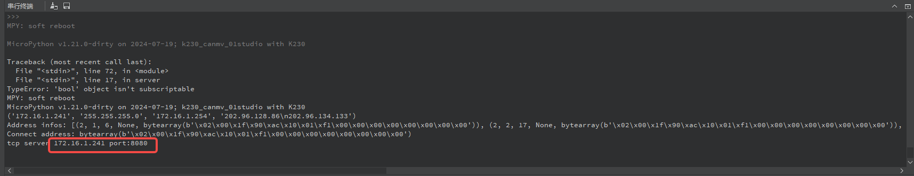

# 4. TCP-Server例程讲解

## 1. 环境准备

为了顺利进行TCP通信的演示，我们需要确保以下环境已经配置妥当：

### 1.1 硬件连接

- 确保你的CanMV开发板和电脑都已经通过网线连接到同一个路由器或交换机上，形成一个局域网。
- 路由器或交换机需要正常工作，以确保网络通畅。

### 1.2 关闭防火墙

- 为了避免防火墙拦截TCP通信，建议暂时关闭电脑上的防火墙。

```{image} ../images/network/image-20240722145319713.png
:scale: 50 %
```

### 1.3 工具准备

- 下载并安装[NetAssist网络调试助手](https://www.cmsoft.cn/resource/102.html)工具，这将帮助我们进行网络数据的收发测试。

### 1.4 记录IP地址

- 打开CMD（命令提示符），输入`ipconfig`指令，查看并记录电脑网口所分配的IP地址。这将用于后续设置和测试。

```{image} ../images/network/image-20240722145500693.png
:scale: 50 %
```

## 2. 服务端例程解析

### 2.1 导入必要的库

```python
import socket  
import network  
import time
```

- `socket` 库用于创建套接字，它是网络通信的基础。
- `network` 库用于处理网络接口的配置，如启用和配置LAN接口。
- `time` 库在这个例程中虽然没有直接使用，但在处理网络请求时，它可能用于超时控制或延迟处理。

### 2.2 定义服务内容

```python
CONTENT = b"""  
Hello #%d from k230 canmv MicroPython!  
"""
```

这里定义了一个字节串`CONTENT`，它将被发送给连接到服务器的每个客户端。`%d`是一个占位符，用于后续插入一个数字（在这个例子中是计数器`counter`的值）。

### 2.3 创建并配置服务器

```python
def server():  
    # 获取并配置LAN接口  
    a = network.LAN()  
    if a.active():  
        a.active(0)  # 如果接口已激活，先关闭  
    a.active(1)      # 重新激活接口  
    a.ifconfig("dhcp")  # 使用DHCP自动获取IP地址  
    ip = a.ifconfig()[0]  # 获取IP地址  
    print(a.ifconfig())  # 打印网络接口的配置信息  
  
    # 创建socket并绑定到指定地址和端口  
    s = socket.socket(socket.AF_INET, socket.SOCK_STREAM, 0)  
    s.setsockopt(socket.SOL_SOCKET, socket.SO_REUSEADDR, 1)  # 允许地址重用  
    ai = socket.getaddrinfo(ip, 8080)  # 获取地址信息  
    addr = ai[0][-1]  # 提取地址和端口号  
    s.bind(addr)  # 绑定socket到地址和端口  
    s.listen(5)  # 开始监听，最多允许5个等待连接的客户端  
  
    # 打印服务器信息  
    print("tcp server %s port:%d\n" % (ip, 8080))
```

### 2.4 处理客户端连接

```python
counter = 1  
    while True:  
        # 接受客户端连接  
        res = s.accept()  
        client_sock, client_addr = res  # 解包元组  
        print("Client address:", client_addr)  
        print("Client socket:", client_sock)  
  
        # 设置非阻塞模式（可选，取决于你的应用需求）  
        client_sock.setblocking(False)  
  
        # 向客户端发送消息  
        client_sock.write(CONTENT % counter)  
  
        # 读取客户端数据并响应  
        while True:  
            try:  
                h = client_sock.read()  # 尝试读取数据  
                if h:  
                    print(h)  
                    client_sock.write(b"recv: " + h)  # 回复客户端  
  
                if b"end" in h:  # 如果收到"end"，则关闭连接  
                    client_sock.close()  
                    break  
            except Exception as e:  
                # 处理可能的异常，如非阻塞模式下的EAGAIN错误  
                print("Error:", e)  
                time.sleep(0.1)  # 短暂休眠后重试  
  
        counter += 1  
        if counter > 10:  
            print("server exit!")  
            s.close()  
            break
```

**注意**：在这个例程中，添加了对`read()`可能抛出的异常的处理，这在非阻塞模式下是常见的。

### 2.5 完整例程

```python
#配置 tcp/udp socket调试工具
import socket
import network
import time

CONTENT = b"""
Hello #%d from k230 canmv MicroPython!
"""

def server():
    #获取lan接口
    a=network.LAN()
    if(a.active()):
        a.active(0)
    a.active(1)
    a.ifconfig("dhcp")
    ip = a.ifconfig()[0]
    print(a.ifconfig())
  
    counter=1
  
    #建立socket
    s = socket.socket(socket.AF_INET, socket.SOCK_STREAM, 0)
    #设置属性
    s.setsockopt(socket.SOL_SOCKET, socket.SO_REUSEADDR, 1)
    #获取地址及端口号 对应地址
    ai = socket.getaddrinfo(ip, 8080)
    print("Address infos:", ai,8080)
    addr = ai[0][-1]
    print("Connect address:", addr)
    #绑定
    s.bind(addr)
    #监听
    s.listen(5)
    print("tcp server %s port:%d\n" % ((network.LAN().ifconfig()[0]),8080))


    while True:
        #接受连接
        res = s.accept()
        client_sock = res[0]
        client_addr = res[1]
        print("Client address:", client_addr)
        print("Client socket:", client_sock)
        client_sock.setblocking(False)

        client_stream = client_sock
        #发送字符传
        client_stream.write(CONTENT % counter)

        while True:
            #读取内容
            h = client_stream.read()
            if h != b"" :
                print(h)
                #回复内容
                client_stream.write("recv :%s" % h)

            if "end" in h :
                #关闭socket
                client_stream.close()
                break

        counter += 1
        if counter > 10 :
            print("server exit!")
            #关闭
            s.close()
            break

#main()
server()
```

## 3. 例程现象与操作说明

运行例程源码，记录串口终端打印输出的IP与端口号信息：



在网络调试组手中，选择TCP Client，输入串口终端打印出来的IP与端口号，建立连接：

```{image} ../images/network/image-20240722162513633.png
:scale: 50 %
```
