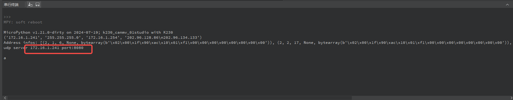

# 6. UDP-Server 例程讲解

## 1. 环境准备

为了确保顺利进行 UDP 通信的演示，我们需要确认以下环境已正确配置：

### 1.1 硬件连接

- 请确保您的 CanMV 开发板和电脑通过网线连接至同一个路由器或交换机，形成局域网。
- 确保路由器或交换机正常工作，以保证网络连接的稳定性。

### 1.2 关闭防火墙

- 为了避免防火墙阻止 UDP 通信，建议暂时关闭电脑的防火墙。

```{image} ../images/network/image-20240722145319713.png
:scale: 50 %
```

### 1.3 工具准备

- 下载并安装 [NetAssist 网络调试助手](https://www.bing.com/search?q=netassist+cmsoft) 作为网络通信的测试工具，帮助实现网络数据的收发。

### 1.4 获取 IP 地址

- 打开命令提示符（CMD），输入 `ipconfig`，查询并记录电脑网卡的 IP 地址，供后续配置和测试使用。

```{image} ../images/network/image-20240722145500693.png
:scale: 50 %
```

## 2. 服务端例程解析

本例程展示如何创建一个简单的 UDP 服务器，包括配置网络接口、创建 socket、绑定地址和端口、接收和发送数据以及关闭 socket。通过这个例程，你可以学习如何构建基本的网络通信应用。

### 2.1 导入必要的库

```python
import socket  
import network  
import time
```

- `socket`：用于创建套接字，是网络通信的基础。
- `network`：用于配置网络接口，如 LAN 或 WLAN。
- `time`：用于延时处理，在网络请求中可能用于超时控制。

### 2.2 配置网络接口

```python
def network_use_wlan(is_wlan=True):
    if is_wlan:
        sta = network.WLAN(0)
        sta.connect("Canaan", "Canaan314")
        print(sta.status())
        while sta.ifconfig()[0] == '0.0.0.0':
            os.exitpoint()
        print(sta.ifconfig())
        ip = sta.ifconfig()[0]
        return ip
    else:
        a = network.LAN()
        if not a.active():
            raise RuntimeError("LAN interface is not active.")
        a.ifconfig("dhcp")
        print(a.ifconfig())
        ip = a.ifconfig()[0]
        return ip
```

这段代码根据输入参数配置网络接口，流程如下：

1. **WLAN 模式**：  
   - 若 `is_wlan=True`，则配置无线网络接口（ WLAN），连接到指定的 Wi-Fi 网络（ SSID 为 "Canaan"，密码为 "Canaan314"）。
   - 输出 WLAN 连接状态，等待分配有效 IP 地址。
   - 成功连接后，打印网络配置并返回 IP 地址。

1. **LAN 模式**：  
   - 若 `is_wlan=False`，则配置有线网络接口（ LAN）。
   - 激活 LAN 接口并检查状态。若未激活，抛出异常。
   - 使用 DHCP 获取 IP 地址，打印网络配置并返回 IP。

### 2.3 创建 UDP 套接字

```python
# 创建 UDP socket  
s = socket.socket(socket.AF_INET, socket.SOCK_DGRAM)  
# 设置 socket 选项，允许地址重用  
s.setsockopt(socket.SOL_SOCKET, socket.SO_REUSEADDR, 1)  
# 获取地址及端口号并绑定 socket  
ai = socket.getaddrinfo(ip, 8080)  
addr = ai[0][-1]  
s.bind(addr)
```

我们创建了一个 UDP 类型的套接字，并设置了 `SO_REUSEADDR` 选项，允许地址重用。然后通过 `getaddrinfo` 获取地址和端口号信息，并将 socket 绑定到该地址和端口。

### 2.4 接收与发送数据

```python
# 延时 1 秒，确保 socket 绑定完成  
time.sleep(1)  
  
# 接收数据并回复  
for j in range(10):  
    try:  
        data, addr = s.recvfrom(800)  # 接收数据，最多 800 字节  
        print("Received:", data, "from", addr)  
        # 回复包含接收数据和接收次数的消息  
        response = b"%s have recv count=%d " % (data, j)  
        s.sendto(response, addr)  
    except Exception as e:  
        print("Error:", e)  # 打印异常信息，便于调试  
  
# 关闭 socket  
s.close()  
print("UDP Server exited!!")
```

程序通过 `recvfrom` 方法接收最多 800 字节的数据，并将收到的数据和客户端地址打印出来。随后，构造回复消息并通过 `sendto` 发送。程序内嵌了异常处理，以便捕获并调试错误。

### 2.5 完整例程

```python
# 配置 tcp/udp socket 调试工具
import socket
import time, os
import network

def network_use_wlan(is_wlan=True):
    if is_wlan:
        sta = network.WLAN(0)
        sta.connect("Canaan", "Canaan314")
        print(sta.status())
        while sta.ifconfig()[0] == '0.0.0.0':
            os.exitpoint()
        print(sta.ifconfig())
        ip = sta.ifconfig()[0]
        return ip
    else:
        a = network.LAN()
        if not a.active():
            raise RuntimeError("LAN interface is not active.")
        a.ifconfig("dhcp")
        print(a.ifconfig())
        ip = a.ifconfig()[0]
        return ip

def udpserver():
    # 获取 LAN 接口 IP 地址
    ip = network_use_wlan(True)
      
    # 获取地址及端口号对应地址
    ai = socket.getaddrinfo(ip, 8080)
    print("Address infos:", ai)
    addr = ai[0][-1]

    print("udp server %s port:%d\n" % (ip, 8080))
    # 建立 socket
    s = socket.socket(socket.AF_INET, socket.SOCK_DGRAM)
    s.setsockopt(socket.SOL_SOCKET, socket.SO_REUSEADDR, 1)
    s.bind(addr)
    time.sleep(1)  # 延时 1 秒，确保 socket 准备就绪
  
    counter = 0
    while True:
        os.exitpoint()
        data, addr = s.recvfrom(800)
        if data == b"":
            continue
        print("recv %d" % counter, data, addr)
        s.sendto(b"%s have recv count=%d " % (data, counter), addr)
        counter += 1
        if counter > 10:
            break
    s.close()
    print("udp server exit!!")


#main()
udpserver()
```

具体接口定义请参考 [socket](../../api/extmod/K230_CanMV_socket 模块 API 手册 .md) 和 [network](../../api/extmod/K230_CanMV_network 模块 API 手册 .md)。

## 3. 例程现象与操作说明

运行代码后，串口终端会输出服务器的 IP 地址与端口号信息：



在网络调试助手中选择 UDP，配置连接参数：

```{image} ../images/network/image-20240722170233348.png
:scale: 50 %
```

发送数据并观察服务器的响应：

```{image} ../images/network/image-20240722170412175.png
:scale:  50 %
```
