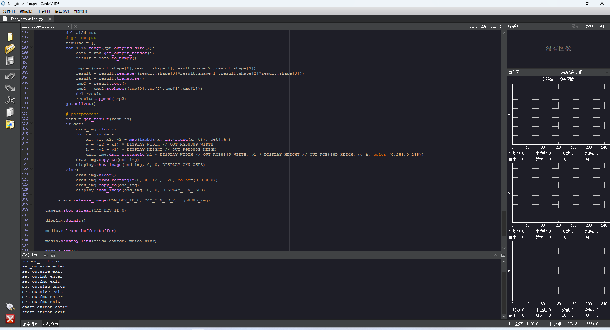

# 2.人脸检测

## 1. 概述

K230 CanMV 人脸检测是通过python语言开发实现的一个简单的具备摄像头数据采集预览，人脸检测画框功能的应用。该示例程序应用到了K230 CanMV 平台的多个硬件模块：AI2D，KPU，Camera，Display等。

## 2. 硬件环境

运行该示例程序需要如下硬件环境：

- K230 CanMV开发板及配套的Sensor模组
- 支持HDMI接口的显示器

## 3. 源码位置

源码路径位于K230 CanMV SDK的`tests/demo/`，如下：

```shell
tests/demo/
└── face_detection.py
```

## 4. 运行示例代码

通过K230 CanMV IDE 打开示例程序代码，并点击运行按钮开始运行人脸检测示例程序。有关IDE的使用请参考《K230_CanMV_IDE使用说明》，有关镜像烧录及开发环境搭建请参考《K230_CanMV使用说明》

通过IDE打开示例程序并运行如下图所示：


运行结果如下图所示：

