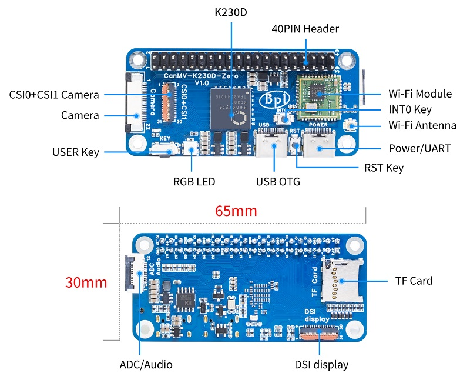
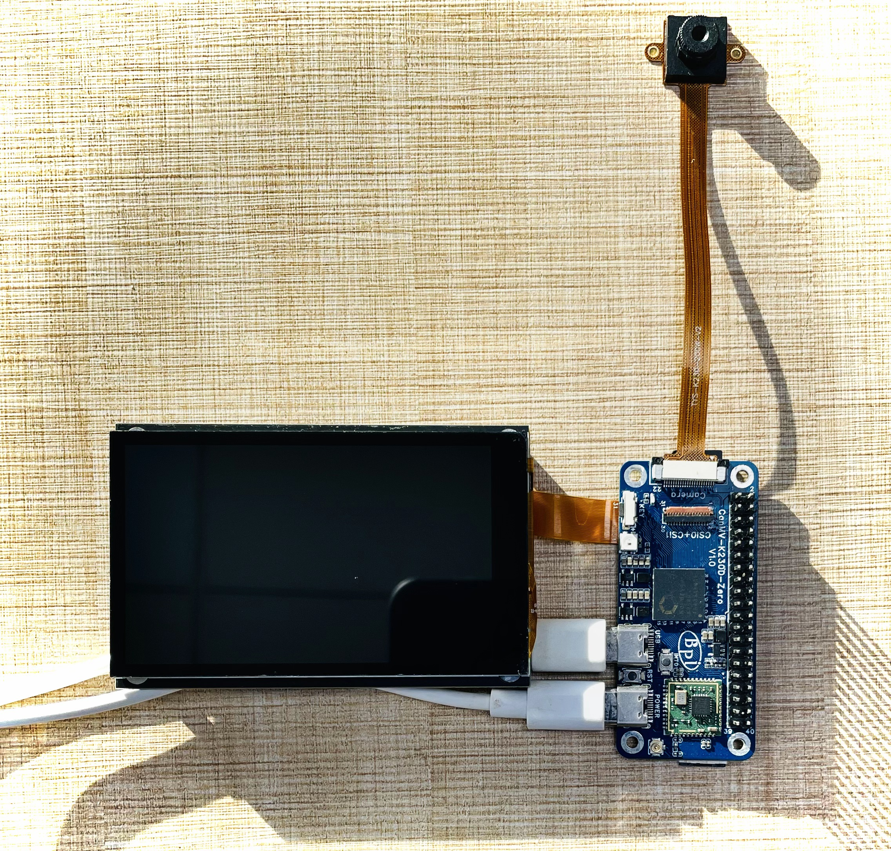

# CanMV-K230D-Zero 开发板

## 1. 概述

CanMV-K230D Zero 开发板由嘉楠科技和香蕉派开源社区联合设计开发，旨在探索 RISC-V Vector 1.0 技术的前沿应用。该开发板集成了高性能的 K230D 芯片，采用双核玄铁 C908 RISC-V CPU，并配备嘉楠自主研发的第三代 KPU（神经网络处理单元）。板载 128MB LPDDR4 内存，可提供出色的本地推理运算能力。CanMV-K230D Zero 以其紧凑的设计和丰富的开发资源，广泛适用于 DIY 项目、物联网设备和嵌入式系统开发，是学习编程、开发边缘 AI 音视频产品和进行性能评估的理想选择。

## 2. 技术规格

| 参数           | 说明                                                         |
|----------------|--------------------------------------------------------------|
| **CPU**        | 玄铁 C908 双核 RISC-V CPU   CPU1: 1.6GHz，支持 RVV1.0   CPU2: 800MHz |
| **KPU**        | 第三代神经网络处理单元，支持 INT8/INT16 等多种数据类型   典型性能：ResNet50 >= 85fps@INT8, MobileNet_v2 >= 670fps@INT8, YOLOv5s >= 38fps@INT8 |
| **DPU**        | 内置 3D 结构光深度引擎，最大支持 1920×1080 分辨率            |
| **VPU**        | 内置 H.264/H.265 硬件编解码器                                |
| **图像输入**   | 2 路 MIPI-CSI（2-lane 和 4-lane）        |
| **显示输出**   | MIPI DSI 接口，支持最高 1080P 分辨率输出                     |
| **运行内存**   | 128MB LPDDR4                        |
| **存储扩展**   | 板载 TF 卡插槽，最大支持 1TB 扩展                            |
| **USB**        | 1 个 USB 2.0 接口，支持 OTG 功能                             |
| **网络**       | 内置 2.4GHz Wi-Fi 模块                                        |
| **音频**       | 支持外接音频输入输出接口                                     |
| **GPIO 扩展**  | 40 引脚 GPIO 扩展，支持 I2C、UART、I2S、SPI、PWM、ADC、JTAG 等接口 |
| **按键**       | 功能按键 1 个，复位按键 1 个                                 |
| **电源**       | USB Type-C 接口，输入电压 5V，电流 2A                         |
| **尺寸**       | 长 65mm，宽 30mm，高 7mm                                     |

## 3. 连接示意图

使用 BPI-CanMV-K230D Zero 开发板时，需要同时连接两根 USB 数据线，其中一根用于供电，另一根用于串口通信。

