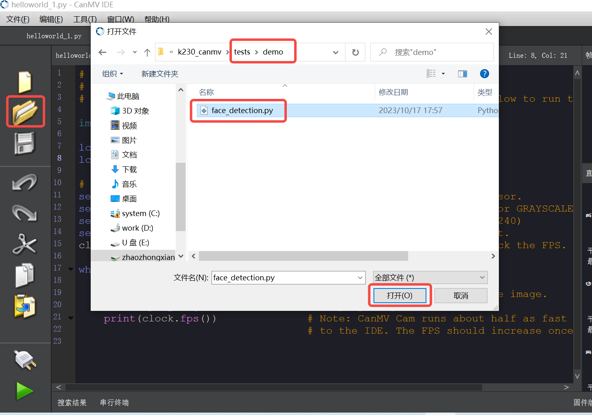
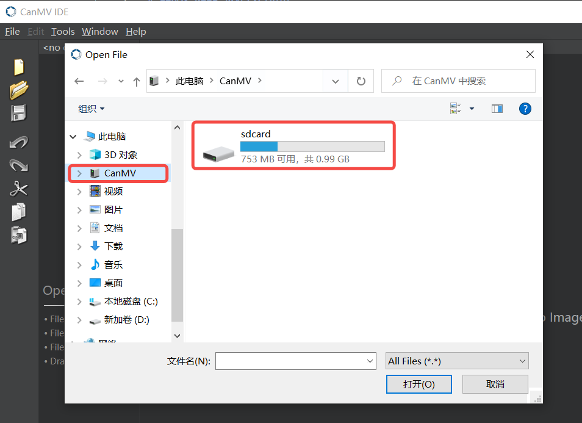

# 运行示例程序

## 概述

从 K230 CanMV `V0.5` 版本开始，支持虚拟 U 盘功能。虚拟 U 盘中预装了示例脚本，用户无需从网络下载即可直接使用。

当固件正确烧录并成功启动后，用户可以在电脑中看到虚拟 U 盘 `CanMV`。打开虚拟 U 盘后，进入 `tests` 或 `examples` 目录（不同版本的文件夹名称可能有所不同），即可看到不同类别的示例程序。用户可以在 IDE 中选择相应的脚本，点击运行，体验对应的示例程序。

## 运行示例程序

```{note}
如果尚未安装 IDE，请参考 [IDE 使用说明](./how_to_use_ide.md) 进行安装。
```

对于 K230 CanMV `V0.5` 版本之前的用户，您可以从以下链接下载测试程序并通过 IDE 加载运行：[测试程序下载地址](https://github.com/kendryte/k230_canmv/tree/main/fs_resource/tests)。



点击 IDE 中的“打开”按钮，选择下载的测试文件并打开。然后点击左下角的绿色“运行”按钮，程序将开始执行。稍作等待后，显示器上会显示由传感器采集的图像。该示例程序为人脸检测程序，运行后可以看到图像中的人脸被框选出来。

对于 K230 CanMV `V0.5` 及之后的版本，建议使用虚拟 U 盘中的示例程序。插入开发板后，打开电脑上的“我的电脑”或“此电脑”，在设备和驱动器中会出现名为 `CanMV` 的虚拟 U 盘。


在虚拟 U 盘中，选择并打开所需的示例脚本。



例如，运行人脸检测示例时，您可以在 `tests` 或 `examples` 目录中找到相应的脚本。


运行程序后，显示器将显示 AI 人脸检测演示结果，图像中的人脸会被自动框选标记。


